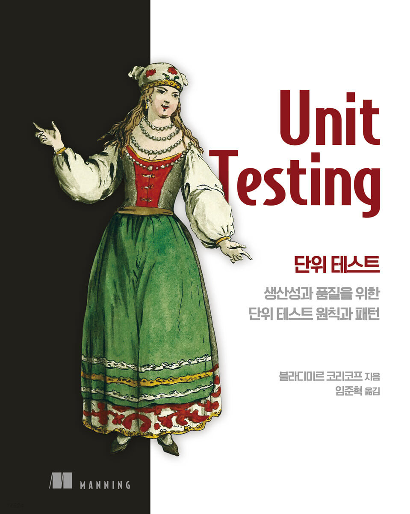

# 유닛 테스트 스터디

## 개요

* 주제: Unit Testing
* 기간: 2022.10.26 ~ 2023.01.11
* 진행 도서: [유닛 테스트(블라디미르 코리코프)](https://product.kyobobook.co.kr/detail/S000001805070)
* 진행 방식
  * 독서, 이론공부 스터디
  * 공부 후 미팅때 자신의 공부 내용을 발표
  * 발표한 내용에 대해 토론
  * 발표 내용을 기록

## 일정
|일정|내용|
|---|---|
|22.10.26|[0. 오리엔테이션](/ch00/orientation.md)|
|22.11.02|[1. 단위 테스트의 목표](/ch01/ch01.md)|
|22.11.09|[2. 단위 테스트란 무엇인가](/ch02/ch02.md)|
|22.11.16|[3. 단위 테스트의 구조](/ch03/ch03.md)|
|22.11.23|4. 좋은 단위테스트의 4대 요소|
|22.11.30|5. 목(Mock)과 테스트의 취약성|
|22.12.07|6. 단위테스트의 스타일|
|22.12.14|7. 가치 있는 단위 테스트를 위한 리팩터링|
|22.12.21|8. 통합 테스트를 하는 이유|
|22.12.28|9. 목(Mock) 처리에 대한 모범 사례|
|23.01.04|10. 데이터베이스 테스트|
|23.01.11|11. 단위 테스트 안티 패턴|
|23.01.18|12. 마무리 및 회고|
