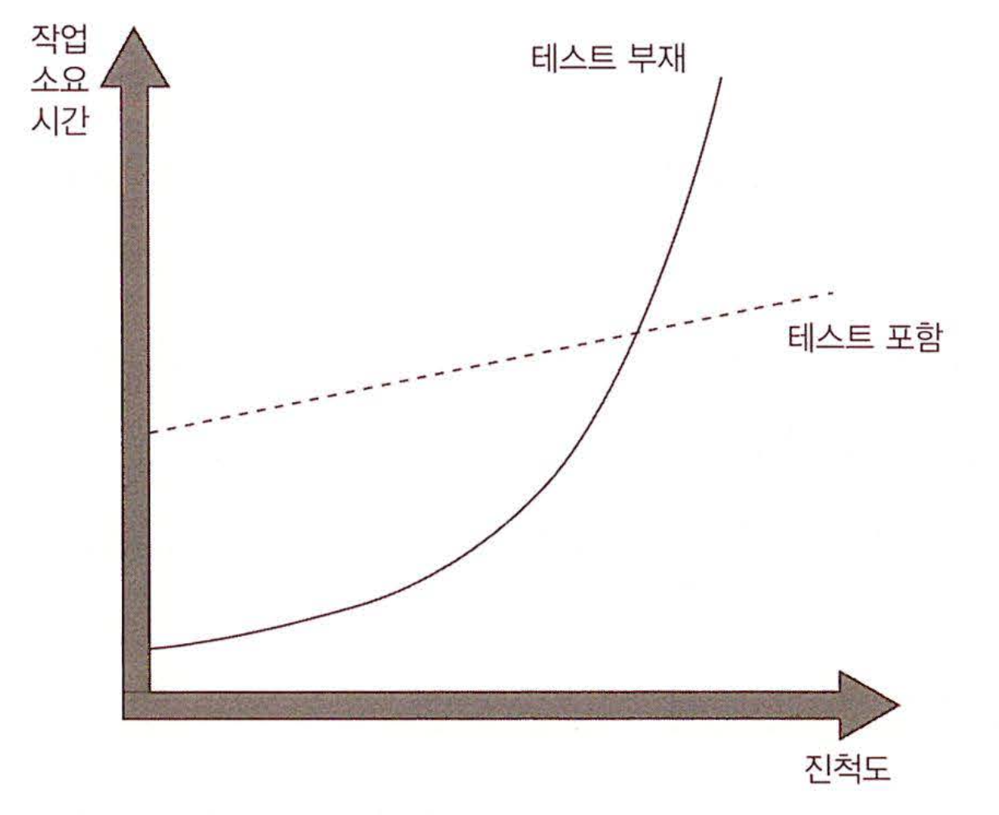

# 1장. 단위 테스트의 목표

## 책 정리

### 개요

* XCTest같은 프레임워크나 Mock 라이브러리 같은 언어, 프레임워크에 너무 의존하지 않는다.
* 최소한의 투자로 최대한의 투자대비 이득을 얻도록 노력한다.

### 현황

* (책에 설명에 따르면)단위테스트는 대부분의 기업에서 필수로 자리잡았다.
* 많은 프로그래머들은 단위테스트를 실천하고 그 중요성또한 인지하고 있다.
* 단순한 일회성 프로젝트가 아니라면, 단위테스트는 늘 적용해야 한다.
* 수많은 기업이 코드커버리지를 달성하고 있다.
* 코드와 테스트코드의 비율은 1:1 ~ 1:3정도가 되며, 높을경우 1:10이 되기도 한다.
* 단위 테스트 또한 발전하고 있다.
* 따라서 많은 프로그래머들이 이제는 단위테스트를 해야하는가? 보다는 어떻게 해야지 좋은 단위테스트가 되는가? 를 고민하기 시작했다.
  * 하지만 아직까지는 그런 고민을 하는 프로그래머들이 많지 않다.
* 좋은 테스트에 대한 고민을 하지 않는다면, 오히려 프로젝트의 품질을 더 저하시킬 수 있다.

### 목표

* 단위 테스트를 적극적으로 도입함으로써, 프로젝트의 설계 또한 더 나은방향으로 간다.
  * 하지만 그것이 단위테스트의 주 목표는 아니다.
* 프로젝트를 끊임없이 성장하게 하는것이 단위테스트의 주 목표이다.
  * 도태되는 코드를 줄이거나
  * 진척도에 관계 없이 일정한 페이스를 유지하는등의 기술 부채를 줄여나가는 것
* 하지만 초반에 그만큼의 비용투자가 필요하지만, 전체적으로 생각해 보았을 때 그 비용은 손해가 아님을 알게 된다.

#### 좋은 테스트? 좋지 않은 테스트?

* 좋지 않은 테스트를 할 경우, 어느정도 진행이 된 프로젝트에서 시간 절약이 불가능해진다.
* 모든 코드에 대한 테스트를 작성할 필요는 없다.
  * 작성하는 테스트가 프로젝트 품질에 얼만큼의 영향을 끼칠지 항상 고민해야 한다.
* 코드를 변경할 때, 연관되어있는 테스트 코드 또한 함께 점검한다.
* 코드를 이해하려고 할 때에는 테스트를 읽는데 시간을 투자한다.
  * 이는 테스트 코드의 품질이 좋아야 한다는 전제가 있다.
* 따라서 단위테스트의 가장 중요한 부분은, 단위테스트의 품질이다.

#### 커버리지?

* 코드 커버리지는 테스트 스위트의 품질을 평가하는 데 자주 사용된다.
  * 테스트 스위트(test suite) -> 테스트들의 묶음
* 커버리지 숫자가 높을수록 좋기는 하지만, 그것이 단위테스트의 품질을 측정하는 지표로 활용될 순 없다.
  * 좋은 단위 테스트의 핵심은 단위 테스트의 품질을 높이는 것 이지만,
  * 코드 커버리지는 말 그대로 프로젝트 코드에 얼마만큼의 테스트가 도입되어있냐를 따질 뿐, 품질을 평가할수는 없기 때문이다.
* 따라서 코드 커버리지에 너무 연연할 필요는 없다. 오히려 그것이 테스트를 더욱 더 악화시킬 수 있다.

#### 무엇이 성공적인 테스트들을 만드는가?

* 필요한 테스트들을 적재적소에 잘 작성하고
* 테스트를 일일히 평가한다.
* 테스트가 얼마나 좋은지 자동으로, 정량적으로 평가는 불가능하다.
* 개인의 판단이 중요하기 때문에, 그 판단의 기준을 열심히 고민해야 한다.
* 하지만 성공적인 테스트 스위트는 몇가지의 특징이 있는데..
  * 개발 주기에 통합되어 있다.
  * 코드에서 가장 중요한 부분만을 대상으로 한다.
    * 주로 비즈니스 로직이며, 
    * 그 외 코드는 범주를 나눠 묶어서 테스트를 하는것도 좋은 방법이다.
    * 결국 중요한 부분과, 중요하지 않은 부분을 위해서라도, 코드들을 잘 분리하는게 중요하다.
  * 최소한의 유지비용으로 최대한의 가치를 이끌어 낸다.
* 따라서 책에서 가장 중요한 부분은
  * 중요한 테스트인지 식별하고
  * 중요한 테스트를 작성하는 것.

#### 이 책을 꾸준히 공부한다면.. (=책을 읽으며 or 이후에 프로젝트를 진행하며 고민해봐야할 부분은?)

* 어떤 것을 제거하고, 어떤것을 중점적으로 개발해야하는지에 대한 판단
* 단위테스트에 대한 기초를 다진 후, 실천
* 테스트 스위트를 리팩토링 하는 방법
* 단위 테스트의 다양한 접근
* 통합테스트로 인한 전체적인 동작 검증
* 안티 패턴을 식별하고 예방하기.

## 느낀점, 아쉬운점

* 독서 스터디가 처음이라, 어떻게 기록을 해야할지 많이 고민했다..
* 주변사람들과 얘기를 하다보면, 유닛테스트는 당연한건데도 아직 시도를 안해봤다는것에 자극을 받았다
* 약팔이가 많이 되서, 테스트라는 얘기를 하면, TDD를 생각하는 경향이 있는데.. 그 차이를 잘 설명하는것도 중요할듯?
* 품질에 대한 고민은 코딩이나 테스트나 동일하다
* 단위테스트에 대한 목표보다는, 단위테스트가 무엇이고 왜 해야하는지가 먼저 나왔으면 좋았을 것 같다. (2장)
* 단위테스트를 처음 접하다보면 코드 구조상의 문제를 만나고 설계를 다시해야하는 상황이 생길텐데, 결국은 객체지향에 대한 부수적인 공부가 필요해 보인다.
* 현실적으로 생각해 볼 때, 개인보다는 프로젝트의 인원이 함께 해야하기 때문에 어떻게 활용하기 위해 `어떻게 설득을 해야할까`가 중요한 것 같다.
  * 근데 가장 설명하기 쉬운건, 아래 그림이 아닐까?
  * 
* 코드 커버리지는 단위테스트를 성공적으로 정착시킨 후에 고민해볼 문제인데, 너무 설명이 과하지 않았나? 라는 생각이 조금 든다.