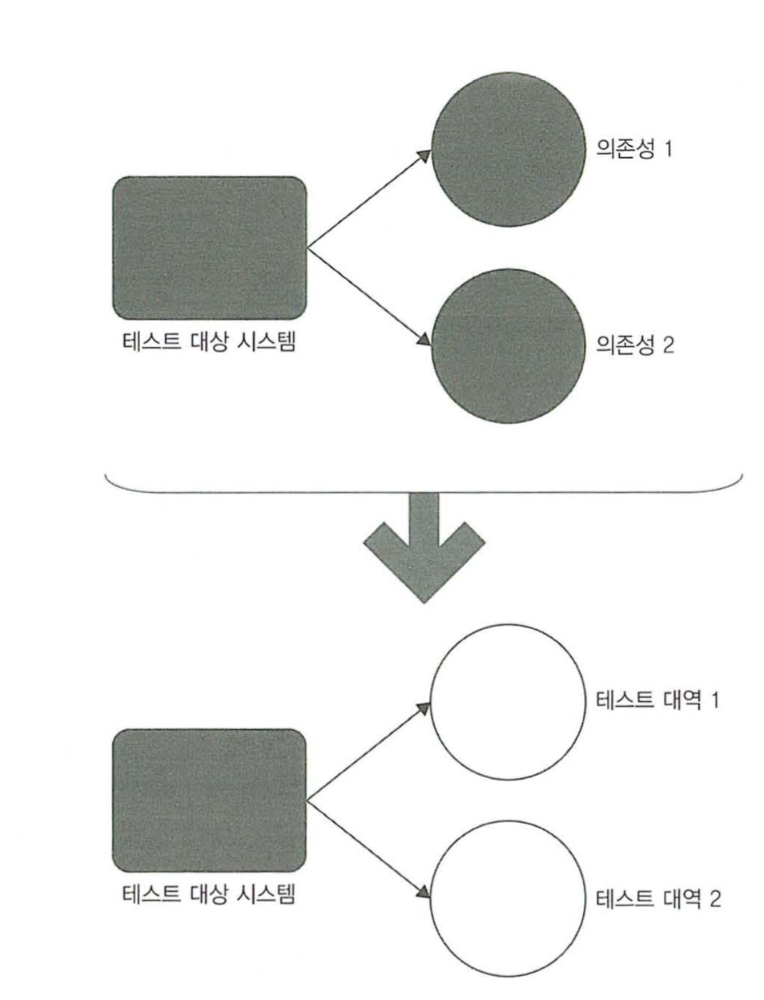
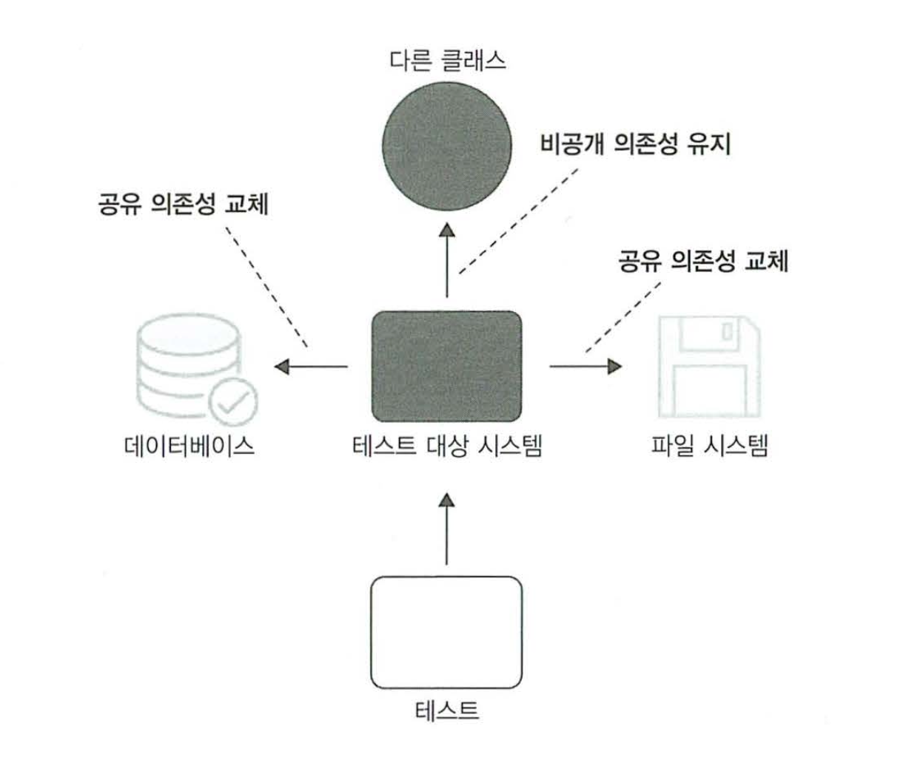
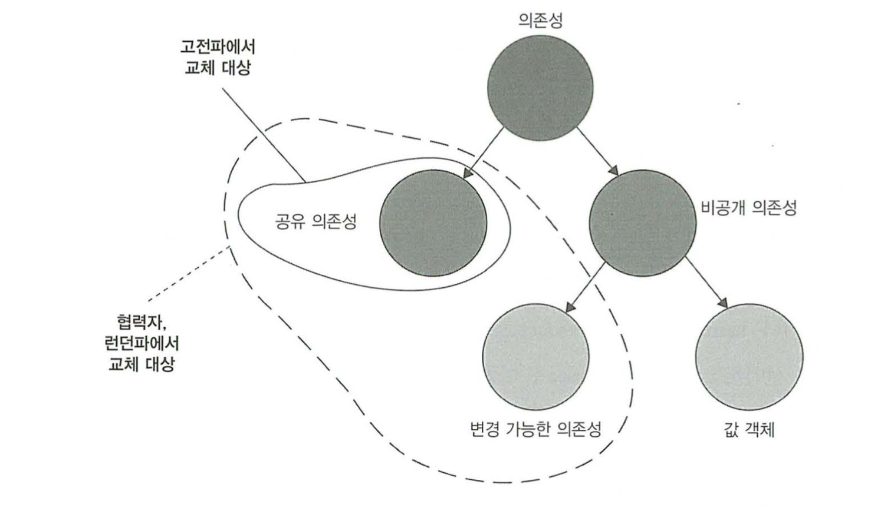
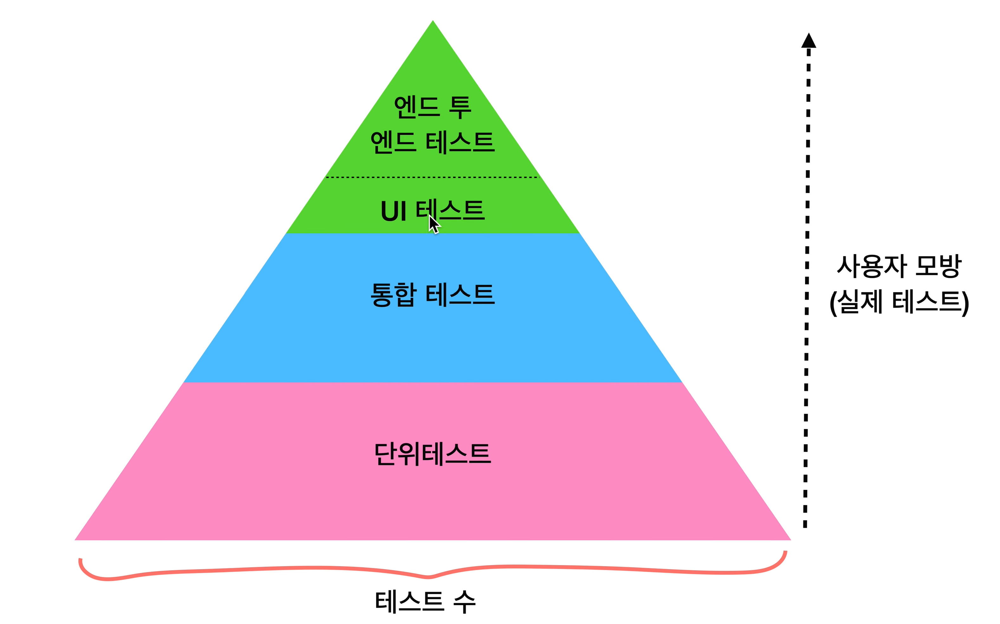

# 2장. 단위 테스트란 무엇인가

## 책 정리

### 개요
* 단위테스트의 정의(=접근?)의 종류는 상당히 많다.
* 하지만 두가지의 방법으로 많이 나뉘는데 그 두가지가..
  * 고전파
  * 런던파
* 고전파는 모든사람이 단위테스트와 TDD에 원론적으로 접근하는 방식
* 두 스타일의 차이를 토대로 `5장 목과 테스트의 취약성`을 자세히 다룬다.

### 단위 테스트의 정의
* 단위테스트는 아래와같은 세가지 속성이 중요하다.
  * 작은 코드 조각(=단위)를 검증
  * 빠르게 수행
  * `격리된 방식`으로 처리하는 자동화된 테스트
* 세번째 속성에서 격리가 무엇인지에 대해 위에서 언급한 고전파와 런던파의 견해차이가 존재한다.

```
고전파? 런던파?

* 고전파
  * 디트로이트(Detroit)라고도 하며, 고전주의적(classicist)접근법이라고도 한다.
  * (저자의 설명으로는) 가장 오래된 자료는 켄트백이 지은 `테스트 주도 개발(2014)`일 것이다.
* 런던파
  * 런던의 프로그래밍 커뮤니티에서 생겨난 분파.
  * 목(mock) 추종자 라고도 표현된다. (mockist)
    * 근데 얘네들은 그렇게 불리는걸 싫어한다;
```

### 고전파 방식과 런던파 방식 테스트의 수도코드
```Swift
// 고전파 방식

// 성공에 대한 테스트
func test_상품구매_성공() {
    var store = Store()
    
    store.add(item: Shampoo, count: 10) // 생성과 입고

    let customer = Customer() // 고객

    let result = customer.purchase(store, Shampoo, 5)

    AssertBool(result, true)
    AssertInt(5, store.get(Shampoo))
}

func test_상품구매_실패() {
    var store = Store()
    
    store.add(item: Shampoo, count: 10) // 생성과 입고

    let customer = Customer() // 고객

    let result = customer.purchase(store, Shampoo, 15)

    AssertBool(result, false)
    AssertInt(10, store.get(Shampoo))
}

// 런던파 방식

func test_상품구매_성공_Mock() {
    /// 수도 코드로 구현하기 위해 이렇게 작성하지만,
    /// 실제로 스위프트에서는 StoreMock로 클래스를 만들고, Store를 상속 or 프로토콜로 채택할것 같다.
    var storeMock = Mock<Store>()

    storeMock
        .setup{ $0.hasEnoughInventory(Shampoo, 5) }
        .returns(true)

    var customer = Customer()

    let result = customer.purchase(storeMock.obj, shampoo, 5)

    AssertBool(result, true)
    AssertInt(storeMock.inventoryCount(Shampoo, 5), 0)
}

func test_상품구매_실패_Mock() {
    var storeMock = Mock<Store>()

    storeMock
        .setup{ $0.hasEnoughInventory(Shampoo, 5) }
        .returns(false)

        var customer = Customer()

    let result = customer.purchase(storeMock.obj, shampoo, 10)

    AssertBool(result, false)
    AssertInt(storeMock.inventoryCount(Shampoo, 10), 5)
}
```

#### 공유 의존성, 비공개 의존성, 프로세스 외부 의존성
* 공유 의존성: 테스트간 공유되고, 서로의 결과에 영향을 미칠수 있는 수단을 제공하는 의존성
* 비공개 의존성: 공유하지 않는 의존성
* 프로세스 외부 의존성: 프로세스 외부에서 실행되는 의존성.


### 격리문제에 대한 접근.
* 런던파
  * 테스트 대상 시스템을 `협력자`에게서 격리하는 것을 일컫는다.
  * 따라서 테스트하려는 클래스에 의존되어있는 `객체`들을  테스트 대역으로 대체한다. (=Mockable)
  * 한번에 한 클래스로 테스트하는 지침을 따르려고 노력한다.
  * 
  * 이런방식으로 `격리`하여 테스트를 하며 얻는 장점은..
    * 코드베이스의 어느 부분이 문제인지 확실하게 알 수 있다.
    * 객체그래프(같은 문제를 해결하는 클래스의 통신망)을 분할할 수 있다.
    * 한번에 한 클래스만 테스트 하기 때문에, 단순한 구조로 접근할 수 있다.
* 고전파
  * 고전파의 방식에서는 코드를 꼭 격리하는 방식으로 테스트하는것은 아니다. 서로를 격리하여 진행하면 된다.
  * 테스트간의 간섭만 없으면 된다. (메모리에 실행되어 있거나, DB등 외부 요소에서 변경이 되어도 그것을 의존, 접근, 도달하지만 않으면 괜찮다)
  * 
  * 위 그림과 같이, 비공개 의존성(공유되지 않는다면)은 격리를 하지 않아도 괜찮다.
  * 싱글턴같은 프로세스 내부의 객체들은 테스트시 새로 만들어 사용한다.
  * 파일시스템이나 데이터베이스같은 공유 의존성 객체들은 테스트 대역으로 대체한다.
    * 대역으로 대체할 경우, 시간을 단축시킨다는 이점도 있다.
  * 견해의 차이에 따라서 공유 의존성이 없는 한, 여러 클래스를 묶어서 단위 테스트를 할 수도 있다.
  * 의존성이 있는 코드자체는 원래 테스트 대역 없이는 어렵다.


||격리 주체|단위의 크기|테스트 대역 사용 대상|
|---|---|---|---|
|런던파|단위|단일 클래스|불변 의존성 외 모든 의존성|
|고전파|단위 테스트|단일 클래스 또는 클래스 세트|공유 의존성|

### 두 분파가 의존성을 다루는 방법



* 런던파
  * 불변하는 공유 의존성 외에는 대역을 사용
* 고전파
  * 공유 의존성에 대역을 사용

### 두 분파의 차이
* 격리문제를 어떻게 다루는가?
* 단위를 어떻게 나누는가?
* 의존성을 어떻게 취급해야 하는가?

## 런던파 단위테스트 장점들에 대한 반론

### 클래스 단위로 테스트?
* 런던파의 경우 입자성이 좋기 때문에, 이러한 부분에서 상당히 용이하나..
* 1장에서 처럼, 모든 코드를 테스트하는건 효율적이지 못하기 때문에 장점이라고 꼽기는 힘들어 보인다.

### 의존성이 큰 클래스 그래프를 테스트 하기
* 복잡한 의존성을 가진 클래스의 경우 대역을 사용하면 쉽게 테스트할 수 있다.
* 하지만 일단 이런식으로 설계를 하지 않는데 집중해야 한다.
* 비용이 많이 들기 때문에, 시간적 비용이 많이 들어간다.

### 단위 테스트를 통한 버그 위치 정확히 찾아내기
* 런던파 스타일의 경우, 정확히 찾아내기가 비교적 수월하다
* 고전파 스타일의 경우 테스트를 하는 클라이언트 테스트도 실패할 수 있지만..
* 테스트를 정기적으로 해 왔다면, 최근 수정한 부분만 확인해도 찾아낼 가능성이 높다.
* 수정 후 테스트 또한 전체적으로 할 필요는 없지만..
* 계단식으로 실패한다면, 그 테스트와 코드에 큰 가치가 있다는것을 확인할 수 있다.

### 두 분파와 TDD
* 런던파 스타일은 TDD에 잘 맞지만
* 고전파 스타일은 TDD보다는 실제 객체를 다루는데 초점이 있다.
* 고전파의 경우, TDD로 개발을 할 때에도 도메인 모델 -> 소프트웨어 사용까지의 계층을 순차대로 둔다

### 통합 테스트


* 런던파는 협력자 객체를 사용하는 모든 테스트를 통합 테스트로 간주한다.
* 따라서 고전파방식의 단위테스트는 런던파 방식으로는 통합테스트로 생각될 수도 있다.
* 둘 이상의 동작 단위를 검증하는것은 통합테스트이다.
* 공유 의존성에 접근하는 테스트는 다른 테스트와 분리가 힘들기 때문에 추가적인 조치가 필요하다.
* 프로세스 외부 의존성 테스트의 경우 퍼포먼스 문제가 생길수 있기 때문에 추가적인 조치가 필요하다.

### 엔드 투 엔드 테스트
* 프로젝트를 최종사용자 관점에서 검증하는 테스트.
* 통합테스트 <-> 엔드 투 엔드 테스트 사이에 뚜렷한 경계는 없다.

## 느낀점, 아쉬운점
* 이해가 잘 안가서 3번정도 읽어본 것 같다. 정리하는 와중에도 쭉 읽어보았다.
* 1장도그렇고 이번 장도 그렇고, 아무래도 이론위주의 책이기도 하고, 개발자가 테스트를 전문적으로 다룬다는 개념이 그리 오래되지 않아, 아직은 여러 방식들이 파편화되어 깔끔하게 정립되어있지 않기 때문 이라는 생각이 든다.
* 위에서도 적었지만, 런던파의 경우 TDD를 위해, 혹은 TDD라는 개념이 생기고 나서 런던파가 생겨난게 아닐까? 싶은 느낌이 든다.
* 현실적으로 생각을 해보면.. 런던파와 고전파의 구분이 필요할까 싶다.. (실질적인 개발보다는 상대방에 대한 설득의 목적이 더 큰게 아닐까 싶다)
* 개발자에게 필요한건, 맨 마지막 피라미드 구조에서 단위테스트와 적당한 수준의 통합테스트만 있으면 되지 않을까?
* 공유 의존성 / 비공개 의존성 / 프로세스 외부 의존성의 구분이 조금 어렵다.
* 조금 걱정스러운 부분은.. 책을 몇번 읽어봐도 어렵게 느꼈다면, 나중에 다른사람을 설득하기도 어려울 것 같다.
* (책의 영향이 있겠지만) 위 생각의 이유로 고전파 스타일로, 최대한 단순하게 시작을 해보는게 어떨까 싶다.