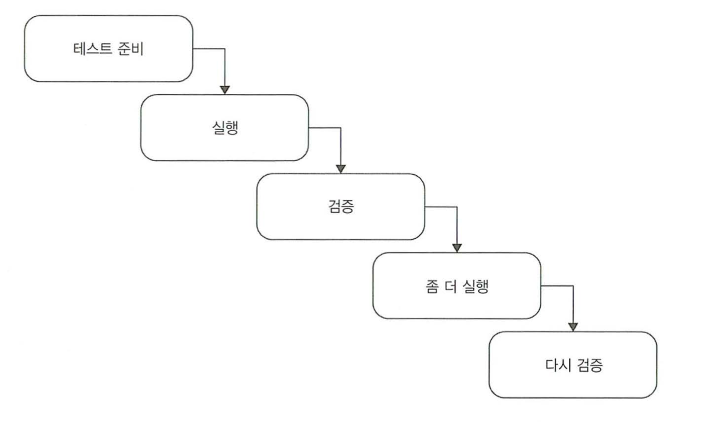

# 단위 테스트 구조

## 책 정리
### 개요
* 준비(arrange) - 실행(act) - 검증(assert) 패턴으로 작성된 단위 테스트의 구조를 살펴본다.
  * Given-When-Then 이라는 패턴도 있으며, 차이는 없다.
* 단위테스트 명명법을 살펴본다.
* 피해야할 사례들을 살펴본다.

### AAA 패턴을 사용한 테스트 예제
```Swift
public class CalculatorTests {
    public void test_sum_of_two_numbers() {
        /// 준비
        let first: Double = 10
        let second: Double = 20
        var calculator = Calculator()

        /// 실행
        let result = calculator.sum(first, second)

        /// 검증
        XCAssertEqual(30, result)
    }
}
```

* 테스트의 구조는 다음과 같은데,
  * 준비 구절에서는 SUT(테스트 대상 시스템)와 해당 의존성을 원하는 상태로 만든다
  * 실행 구절에서는 SUT에서 메서드를 호출하고, 준비된 의존성을 전달하여 출력이 있는 경우 출력 값을 캡처한다.
  * 검증 구절에서는 결과를 검증한다.
* TDD를 실천할 때에는, 기대하는 동작으로 테스트코드를 작성 후, 시스템을 개발 해 나간다.

### 좋지 않은 사례들
#### 여러개의 준비, 검증, 실행


* 이처럼 테스트에서 여러개의 동작 단위를 검증하는것은 피한다.
  * 이것은 단위테스트가 아닌 통합테스트이다.

#### 각 구절은 얼마나 커야 할까?
* `if`문은 피한다.
  * `if`가 들어갔다는 것은 곧 한번에 너무 많은 테스트를 시도한다는것을 뜻한다.
* 준비구절이 가장 크긴 하지만, 너무 크다면 테스트 클래스 내 비공개 메서드 혹은 팩토리 클래스로 분리하는게 좋다.
  * [오브젝트 마더](https://java-design-patterns.com/patterns/object-mother/#)
    * 
    * 테스트에서 유사한 객체를 생성할 수 있게 해주는 팩토리 메서드 패턴
  * [테스트 데이터 빌더](http://www.natpryce.com/articles/000714.html)
    * 오브젝트 마더의 경우 기존 객체가 변경됨에 따라 팽창할 우려가 있는데,
    * 이럴때 테스트 데이터 빌더 패턴을 사용하여 해결할 수 있다.
* 실행은 되도록이면 한줄만
  * 한줄이 넘어가면 베이스 코드를 의심해봐야 한다.
* 하나의 테스트에 하나의 기능을 테스트해야하는데, 검증문은 몇개가 있어도 상관이 없다.
  * 그렇다고 너무 커지는 경우, 베이스 코드에서 추상화를 의심해보고, 동등멤버(동등 비교가 가능한 equal 같은 연산자혹은 메서드)를 정의하여 검증을 줄이는것이 좋다.
* 종료의 경우, 종료가 필요한 상황이 흔하지는 않지만, 필요시 따로 구분하도록 한다.
* 설명이 반드시 필요한 경우에만 주석을, AAA패턴을 철저하게 따른다면 빈줄로 구분하도록 한다.

### xUnit 프레임워크 살펴보기
(iOS 개발자 이기 때문에 간단하게 읽고 넘겼습니다)

#### 테스트픽스쳐 재사용
* 테스트픽스쳐(TestFixture)는 테스트 실행 대상 객체이다.
  * DB의 데이터 혹은 Disk의 파일일 수 있다.
  * 테스트 실행 전 고정상태로 유지를 위해 픽스처라는 단어가 나왔다.
* NUnit 경우 `[SetUp]` 특성을 사용한다.
  * xcTestCase또한 `setUp`이라는 메서드를 사용한다.

#### 테스트픽스쳐를 막 사용하면 안되는 이유..
```Swift
public class CustomerTests {
    var store: Store
    var sut: Customer

    /// 테스트픽스쳐 역할
    public setUp() {
        store = Store()
        store.addInventory(item: .Shampoo, 10)
        sut = Customer()
    }

    func test_purchase_succeeds_when_enough_inventory() {
        let result = sut.purchase(store, item: .Shampoo, count: 5)
        XCTAssertTrue(result)
        XCTAssertEqual(5, store.get(item: .Shampoo))
    }

    func test_purchase_fails_when_not_enough_inventory() {
        let result = sut.purchase(store, item: .Shampoo, count: 15)
        XCTAssertFalse(result)
        XCTAssertEqual(10, store.get(item: .Shampoo))
    }
}
```

* 이렇게 된다면, 테스트간 결합도가 높아지고 가독성이 떨어진다.
* 만약 `setUp()`에서 샴푸의 수량을 15이상으로 설정한다면, 성공 테스트 또한 실패하게 된다.
* 즉, 이런 높은 결합도는 테스트의 안티패턴이다.
* (공감이 잘 안가긴 하는데..) 준비코드가 생성자의 역할을 할 때 테스트의 가독성을 떨어뜨린다.
* 준비 로직이 별로 없더라도, 테스트 메서드로 바로 옮기는 것이 좋다.
* 이러한 부분에서 위에서 말한 오브젝트 마더, 테스트 데이터 빌더를 사용하면 유용하다.

#### 단위테스트 명명법
* 테스트 코드 자체에 집중하기 위해, 테스트 대상 시스템은 `sut`로 명명하는것을 추천한다.
  * 테스트 대상이 많은 경우(=객체가 많은 경우?) `sut`로 테스트 대상을 구분해놓으면, 찾기도 편해진다.
* 테스트명은 정확하게, 장황하게 써놓는것은 별로 도움이 되지 않는다.
* 최대한 직관적으로, 테스트대상 코드를 직접 개발한 개발자가 아니더라도, 개발자가 아니더라도 알아보기 쉽게 작성하는게 좋다.
  * 한국에서는 한글로 이름을 많이 짓기도 한다. (`test_Calculator_Sum_성공_확인()` 같이..)

## 느낀점
* 앞에 이론만 가득한 1,2장보다는 뭔가 직접적인 부분이 많아 좋았다.
* 하지만 C#의, 특정 프레임워크에 대한 설명이 많아 조금 아쉽긴 했다.
  * 그래도 JUnit 계통의 테스트기법들은 거의 모든 언어와 프레임워크에서 지원하기 때문에 Swift와 비교해볼수 있어 나름 유익했다.
* 명명법은 너무 쓸데없이 장황하게 써둔 느낌이 강했다.
* 특정 프레임워크에 대한 설명 + 명명법은 그냥 책 분량늘리기용도?!
* 테스트 대상 시스템의 변수명을 sut로 하라고 한다던가, 테스트픽스처를 개선하기 위해 오브젝트 마더 혹은 테스트 데이터 빌더를 사용하라던가 하는 부분은..
  * 명명법과 테스트픽스처부분에 넣어줬으면 더 읽기 좋았을 것 같다.
* 한글로 이름을 짓는다는건 예전에 TDD스터디때 공부한건데, 번역을 하면서 역자 추가설명에 이런부분을 써놨으면 더 좋았을것 같은 아쉬움이 남는다.