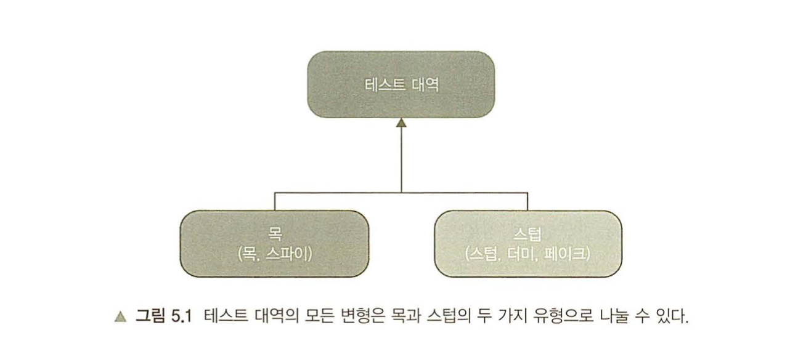
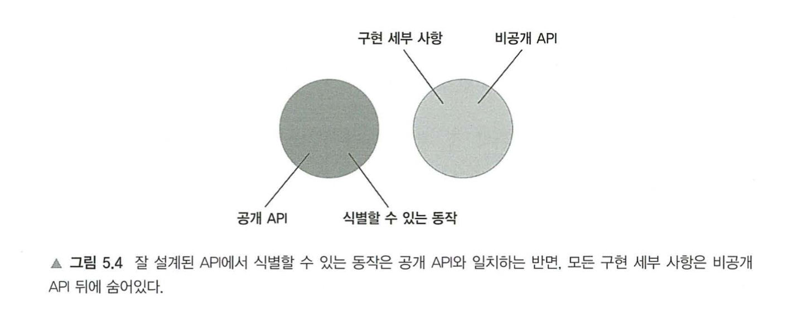
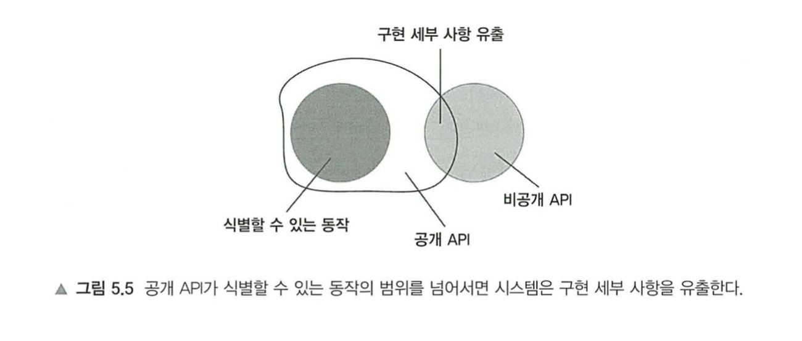
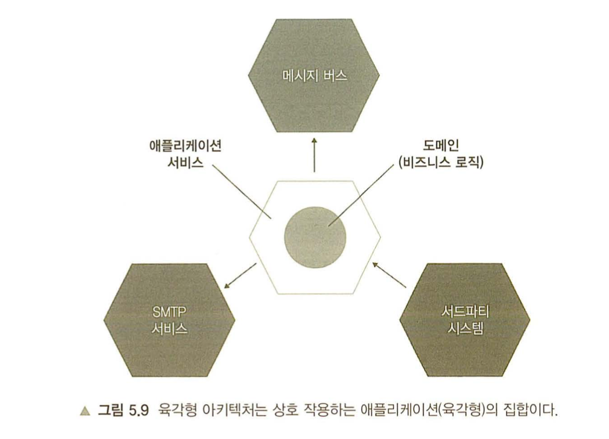
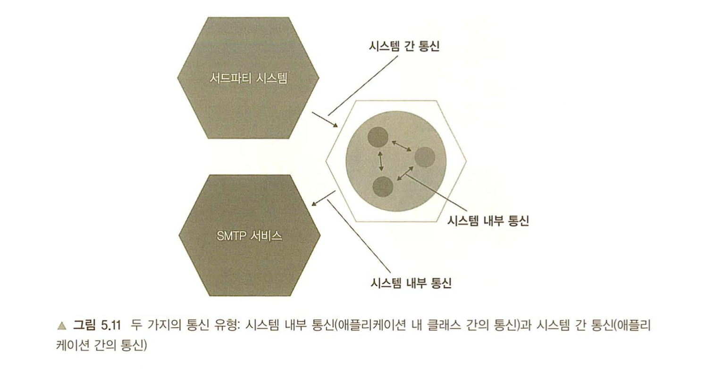

# 목과 테스트의 취약성

## 다루는 내용

```
* 목과 스텁 구분
* 식별할 수 있는 동작과 구현 세부사항 정의
* 목과 테스트 취약성 간의 관계 이해
* 리팩토링 내성 저하 없이 목 사용하기
```

## 개요
* 목(Mock)의 사용은 논란이 있는데, 훌륭한 도구이다 vs 취약성을 초래한다로 대립된다.
* 이 장에서는 어떤부분에서 취약성을 초래하는가를 살펴본다 (리팩토링 내성이 부족해지는 테스트)
* 그리고 어떤 경우에 목을 사용하는게 좋은지 살펴본다

### 목과 스텁



* Mock
  * 목은 외부로 나가는 상호작용을 '대체' 하는데 도움이 된다.
  * 명령
* Stub
  * 내부로 들어오는 상호작용을 '모방' 하는데 도움이 된다.
  * 조회
* 목은 목과 스파이, 스텁은 스텁과 더미, 그리고 페이크로 분류할 수 있다.
* Swift 기준으로 단순하게 생각하면 아래정도로 요약해볼만 할 것 같다
  * 목은 Mockable로 대체된 외부 의존성
  * 스텁은 더미데이터
* 목과 스텁은 유명 라이브러리들에서 Mock, Mockable로 묶이는 경우가 많지만, 이를 구분해야할 필요가 있다.

```Swift
/// Mock의 예시
func test_이메일전송() {
    var mock = Mock<EmailGateway>()
    var sut = Controller(mock.object)

    sut.greetUser("user@email.com")

    // SUT에서 사이드 이펙트를 발생시킬 때(이메일 전송), 미리 만들어둔 Mock 대역으로 사용.
    XCTAssertEqual(mock.sendGreetingsEmail("user@email.com"), true) 
}

/// Stub의 예시
func test_report_생성() {
    var stub = Mock<Database>()

    // dummy의 개념으로, 미리 10명의 유저를 생성
    stub.setUp { $0.GetNumberOfUsers() }.returns(10)

    var sut = Controller(stub.object)

    let report = sut.createReport()

    XCTAssertEqual(10, report.numberOfUsers)
}
```

### 스텁으로는 상호작용을 검증하지 않는것이 좋다.
* 스텁은 SUT가 출력을 생성하도록 입력을 제공한다.
* 하지만 테스트에러 리팩토링 내성을 향상시키는것은 구현이 아닌 최종 결과를 검증하는 것 뿐이다. (=블랙박스 테스트)
* Stub의 예시에서, Mock의 예시의 검증부분 (`sendGreetingsEmail`)까지 검증을 한다면, 과잉명세가 된다.
* 과잉명세 -> 최종 결과가 아닌 사항을 검증하는 행위

### 목과 스텁 함께 쓰기
```Swift
func test_구매실패() {
    var storeMock = Mock<Store>()
    /// Stub의 역할(데이터 설정)
    storeMock.setUp{ .$0.enoughInventory(.Shampoo, 5) }.returns(false)

    var sut = new Customer()

    let success = sut.Purchase(sotreMock.object, .Shampoo, 5)
    
    XCTAssertEqual(false, success)
    /// Mock의 역할(SUT의 명령 검사)
    storeMock.verify(times: .Never){ $0.remove(.Shampoo, 5) }
}
```

* `storeMock`은 스텁과 목 두가지의 역할을 이행한다.
* 구매 요청(상호작용)은 sut에서 이루어 지며, storeMock에서는 상호작용이 이루어졌나 검사만 하므로(=`remove`) 스텁과의 상호작용을 검증하지 말라는 규칙은 위배되지 않는다.
* 테스트대역이 이렇게 목과 스텁의 역할을 할 때에는 보통 Mock이라고 표현된다.

### 명령 조회 분리(CQS, Command Query Separation) 원칙
* 모든 메서드는 명령이거나 조회여야 한다.
* (한 메서드에서)둘을 혼용해서는 안된다.
* 명령 -> 사이드 이펙트를 일으키고, 값을 반환하지 않는다, Mock
* 조회 -> 사이드 이펙트를 일으키지 않고, 값을 반환한다, Stub

### 식별할수 있는 동작은 공개 API와 다르다.
* 모든 제품 코드는 두가지로 분류할 수 있다.
  * 공개 API <-> 비공개 API
  * 식별할수 있는 동작 <-> 구현 세부 사항

### 식별할 수 있는 동작과 구현 세부사항
* 단위테스트의 취약성 -> 리팩터링 내성이 약해지는 것.
* 거짓 양성이 있는 주요 원인 -> 코드의 구현사항이 결합되어있기 때문.
  * 따라서 구현과 테스트를 분리하는것이 좋다.
* 클라이언트가 목표를 달성하는데 도움이 되는 연산(operation)을 노출.
  * 계산을 수행하는 메서드
  * 사이드 이펙트를 초래하는 메서드
* 클라이언트가 목표를 달성하는 데 도움이 되는 상태(state)를 노출.
* 이상적인 API의 예시
  * 
* 구현 세부사항이 외부로 유출되는 API의 예시
  * 


### 구현 세부 사항 유출
```Swift
/// 구현 세부사항이 유출된 코드의 예시

public class User {
    public var name: String { get{} set{} }

    // 해당 속성이 public 이기 때문에, 구현 세부사항이 유출된다.
    public normalize(name: String) -> String {
        let result = name.trim()
        if result.count > 50 {
            return result.substring(0, 50)
        }

        return result
    }
}

public class UserController {
    public rename(userID: Int, newName: String) {
        let user = getUserFromDB(userID)

        let normalizedName = user.normalize(name: newName)

        saveUserToDB(user)
    }
}

/// 구현 세부사항이 유출되지 않은 코드의 예시

public class User {
    private _name: String
    public name: String {
        get { _name }

        set(value) { // 프로퍼티에서 normalize를 수행하며, normalize는 비공개 메서드이다.
            _name = normalize(name: value)
        }
    }

    private normalize(name: String) -> String {
        let result = name.trim()
        if result.count > 50 {
            return result.substring(0, 50)
        }

        return result
    }
}

public class UserController {
    public rename(userID: Int, newName: String) {
        let user = getUserFromDB(userID)

        user.name = newName

        saveUserToDB(user)
    }
}
```

### API 설계 정리
* 캡슐화를 잘 유지하여, 내부 손상을 줄인다.
* 데이터와 연산(=수행 메서드)을 분리하여, 불변성을 위반하지 않도록 주의한다.

||식별할 수 있는 동작|구현 세부사항|
|-|-|-|
|공개|좋음|나쁨|
|비공개|해당 없음|좋음|

### 목과 테스트 취약성 간의 관계
#### 육각형 아키텍쳐
* 외국에서는 꼭 육각형을 이루는게 아니라, 골고루 잘 분리 및 특화되어있는것을 육각형이라고 표현하는 듯 하다, (육각형 스트라이커라고 불리는 것 처럼.. 우리나라로치면 만능형?)
* 계층이 잘 분리되어있는 아키텍쳐
  * 예시로, 서비스와 도메인(비즈니스 로직)이 잘 분리되어있는 아키텍쳐
  * 
* 당연하지만, 도메인이 아닌 서비스에 구현된 인터페이스로 연결이 된다.
* 이처럼 API를 잘 설계하면, 프랙탈 구조를 형성하게 되며, 테스트가 수월해진다(일정하게 비슷한 양상으로 쪼개져 있기 때문)
* 계층이 분리되고, 책임을 줄여 결합도를 낮추는것이 중요.
  
#### 육각형 아키텍쳐의 중요한 지침들
* 도메인 계층과 애플리케이션 서비스 계층 간의 관심사 분리
  * 추가로, 도메인 계층은 해당 비즈니스 로직에 대한 책임만 가져가도록 한다.
* 애플리케이션 내부 통신
  * 단방향 흐름 중시
  * 도메인계층과의 완전한 분리
* 애플리케이션간의 통신
  * 서비스와 도메인이 분리되어있는 육각형 아키텍쳐끼리의 통신, 인터페이스를 통해 서로 연결한다.

#### 시스템간의 통신


* 내부통신 -> 구현 세부사항
* 육각형 아키텍쳐를 구현하도록 노력해서, 프랙탈 구조를 이루고, 
* SUT가 아닌 의존 대상은 Mockable을 적극적으로 활용하는것이 좋다..
* 그 외에는 단위 테스트라기 보다는, 개발 방법론에 관한 설명.
* 해당 부분은 주제를 약간 벗어나는 것 같아서 그림으로 대체..

#### 런던파와 고전파의 재고
||격리 주체|단위의 크기|테스트 대역 사용 대상|
|-|-|-|-|
|런던파|단위|단일 클래스|불변 의존성 외 모든 의존성|
|고전파|단위 테스트|단일 클래스 또는 클래스 세트|공유 의존성|

* 위와같은 의존적 통신과 그것으로 인한 Mockable 활용등의 이유를 들어 볼 때..
* 런던파의 경우 불변 의존성을 제외한 모든 의존성에 Mock사용을 권장한다.
* 따라서 런던파스타일의 경우 시스템 내 통신, 시스템 간 통신을 구분하지 않는다.
* 하지만 무분별한 Mock의 사용은 구현 세부사항과 결합이 되고,
* 그렇게 되면 리팩터링 내성이 약해지게 된다.
* 그런부분에서 공유 의존성만 교체하는 고전파 스타일이 좋다.
* 하지만 고전파의 경우도 Mock 사용을 장려하는 경우가 많아서, 결국 잘 판단해야 한다.

## 정리.
* 테스트 대역은 목, 스텁, 스파이, 더미, 페이크 등을 포괄하는 용어이다.
* Mock은 외부로 나가는 상호작용, Stub은 내부로 들어오는 상호작용을 모방하는데 도움이 된다.
* 둘을 묶어서 Mock이라고 많이 칭한다, 하지만 둘을 구분할 수 있어야 한다.
* 클라이언트가 목표를 달성하는데 직접적으로 도움이 되는 연산을 노출한다.
* 클라이언트가 목표를 달성하는데 직접적으로 도움이 되는 상태를 노출한다.
* 그리고 구현 세부사항을 잘 숨겨, 식별할 수 있는 동작과 분리를 시켜야 한다.
* 육각형 아키텍쳐는 세가지 관점을 강조한다.
  * 도메인과 서비스 계층간의 영향 분리
    * 도메인 계층은 비즈니스 로직을 책임지며
    * 서비스는 도메인 계층과 외부 애플리케이션 간의 작업을 조정한다.
  * 서비스에서 도메인 계층으로의 단방향 흐름.
    * 도메인 계층 내 클래스는 서로에게만 의존해야 하고
    * 서비스 계층의 클래스에 의존해서는 안된다. (하위 흐름)
  * 외부 애플리케이션은 서비스 계층이 유지하는 공통 인터페이스를 통해 연결
    * 도메인계층에 직접적으로 접근해서는 안된다.
* 시스템 내부 통신과, 시스템 간 통신이라는 두가지 통신유형이 있는데..
  * 내부통신은 클래스간의 통신이며
  * 시스템간 통신은 애플리케이션끼리의 통신을 말한다.
* 시스템 내부 통신은 구현 세부사항이다.
* 시스템 내 통신을 검증하려고 목을 사용하면 취약한 테스트로 이어진다(리팩토링 내성 저하)
* 시스템 간 통신(애플리케이션끼리의 통신)이나 통신에서 사이드 이펙트가 외부에 노출될때만 목을 사용하는것이 좋다.

### 느낀점
* 이번에는 내용이 길어서 정리를 잘 못한 것 같다..
  * 정리를 잘 못한 이유는.. 웹 구현쪽의 코드가 익숙하지 않아서 그런 요인이 제법 큰 것 같다.
  * 근데 이런걸 떠나서 점점 본격적으로 내용의 난이도가 올라가는듯한 느낌을 받는다.
* 주요한걸 나열해 보면..
  * 테스트 대역의 종류와 분류
  * 올바른(테스트에 용이한) API의 예시
  * 시스템 내부통신, 외부통신을 위한 준비(육각형 아키텍쳐, 캡슐화, 불변성, 프랙탈 구조 등)
  * 목을 사용해야할 부분과 지양해야할 부분
* 설계의 중요성과, 리팩토링 내성을 상당히 강조하는데.. 이는 테스트 작성 이후 유지보수에 실패하는 경우가 많기 때문에 그런 것 같다.