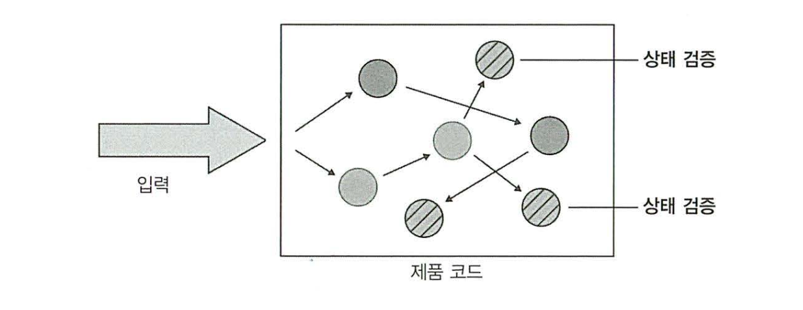

# 단위 테스트 스타일

## 다루는 내용
```
* 단위 테스트 스타일 비교
* 함수형 아키텍처와 육각형 아키텍처와의 관계
* 출력 기반 테스트로 전환
```

## 단위 테스트의 세가지 스타일

### 출력 기반 테스트 (output)


* 입력을 넣고 생성되는 출력을 점검하는 방식.
* 전역상태, 내부상태를 변경하지 않는 코드에만 적용(=불변성을 가진 코드)
* 반환값만 검증
* 함수형 프로그래밍이 필요.

### 상태 기반 테스트 (state)


* 테스트 실행 후 시스템 상태를 점검하는 방식.
* 내부상태가 변경된것을 확인

### 통신 기반 테스트 (communication)


* 목을 사용해 SUT와 협력자간의 통신을 검증

|스타일|검증 대상|특징|
|---|---|---|
|출력 기반 테스트|SUT의 출력값|가장 간결하고 명확하며, 테스트 코드가 불변성을 띄어야 함|
|상태 기반 테스트|SUT의 상태값|고전파 선호|
|통신 기반 테스트|SUT의 상태값, (필요시) 협력자의 상태값|Mock사용, 런던파 선호|

## 스타일 비교
```
4대 요소
* 회귀 방지
* 리팩터링 내성
* 빠른 피드백
* 유지보수성
```

### 회귀 방지, 빠른 피드백 지표로써의 비교

* 테스트 중 실행되는 코드의 양
  * 셋 모두 관계 없음
* 코드 복잡도
  * SUT 외 모든것을 Mock로 사용할 가능성이 있으나, 스타일의 특징이 아닌 좋지 않은 사례.
* 도메인 유의성
  * (책에 나와있지는 않지만) 셋 모두 관계 없음
* 빠른 피드백
  * 외부 의존성과 연결되어있지 않는 한, 세가지 스타일 모두 유의미한 차이는 없음.

### 리팩토링 내성 지표로 비교
* 리팩토링 내성 = 거짓 양성에 대한 척도
* `구현 세부사항과 얼마나 결합시키느냐`에 따라 거짓 양성이 발생할 확률이 올라감.
  * 출력 기반 -> 거짓 양성 방지에 가장 우수
  * 상태 기반 -> 테스트와 SUT 코드(테스트를 넘어서서 SUT의 전체적인)의 결합도가 높을수록 구현 세부사항에 얽매일 가능성이 높아, 상대적으로 위험해짐.
  * 통신 기반 -> Mock을 상대적으로 많이 사용하기 때문에 가장 취약함.
    * 물론 Mock이 되는 협력자를 잘 설계(대표적으로 캡슐화)하면, 거짓 양성을 줄일 수 있음.

### 유지보수성 지표로 비교
* 얼마나 큰가?
* 얼마나 복잡한가?
  * 출력 기반
    * 대부분 짧고 간결하기에, 유지보수가 쉬움.
  * 상태 기반
    * 테스트를 위해 더 많은 코드를 짜야하기 때문에, 출력 기반에 비해 상대적으로 유지보수가 어려움.
    * 헬퍼 메서드(캡슐화를 시켜주는)를 작성하여 완화할 수 있지만.. 그만큼의 비용이 생기므로 쉽지가 않음.
  * 통신 기반
    * 가장 유지보수가 어려움.
    * Mock과의 상호작용 검증이 필요.

### 결론
|지표|출력 기반|상태 기반|통신 기반|
|---|---|---|---|
|리팩토링 내성을 지키기 위한 노력|낮음|중간|중간|
|유지보수 비용|낮음|중간|높음|

* 회귀방지와 빠른 피드백은 테스트 스타일보다는 설계의 문제이므로 의미가 없음.
* 런던파같은 경우 Mockable 하게 테스트를 하기 때문에 통신 기반 테스트를 더 선호하지만, 고전파 같은 경우는 그와 반대.
* 결합도가 낮고, 불변성이 있는 출력 기반의 테스트가 테스트의 4대 요소에 가장 부합함.

## 함수형 아키텍처
### 함수형 프로그래밍

* 
* 함수를 일급 객체로 취급.
  * 수학적 순수 함수
* 
* 함수가 불변성을 가짐.
  * 전역상태에 의존하지 않아, 참조 투명성을 가짐.

### 함수형 아키텍처

* 
* 결정을 내리는 코드(Core) / 결정에 따라 작용하는 코드(가변 셀)를 분리.
* 협력 방식
  * 가변 셀은 모든 입력을 수집
  * 코어는 결정
  * 셀은 코어의 결정을 사이드 이펙트로 변환

### 육각형 아키텍처와 비교
* 육각형 아키텍처는 도메인 계층과 (애플리케이션)서비스 계층을 구별
  * 도메인 계층은 비즈니스 로직에, 서비스 계층은 외부 애플리케이션과의 통신에 책임을 가짐.
* 두 아키텍처 모두 단방향으로 흐름.
* 함수형 아키텍처는 모든 사이드 이펙트를 Core 코드와 분리시킴.
* 육각형 아키텍처는 도메인 계층과 서비스 계층 모두에서 사이드 이펙트를 구분하여 처리.

## 함수형 아키텍처와 출력 기반 테스트로의 전환
```
요약
1. 프로세스 외부 의존성에서 목으로 변경
2. 목에서 함수형 아키텍처로 변경
```
### 예시 - 감사 시스템

* 파일의 가장 마지막 줄에 방문자 정보를 추가.
* 최대 항목수에 도달하면 새 파일을 작성

#### 초기 구현
```Swift
class AuditManager {
    private let maxEntriesPerFile: Int
    private let directoryName: String

    public init(maxEntriesPerFile: Int, directoryName: String) {
        self.maxEntriesPerFile = maxEntriesPerFile
        self.directoryName = directoryName
    }

    public AddRecord(visitorName name: String, timeOfVisit time: Date) {
        // 파일들을 가져옴
        var filePaths = Directory.getFiles(self.directoryName)
        var sorted = SortByIndex(filePaths)

        // 새롭게 등록할 기록 포매팅
        let newRecord = "\(name);\(time)"

        // 파일이 없다면 1부터 새로 작성
        if sorted.isEmpty() {
            let newFile = new Path(self.directoryName + "audit_1.txt")
            File.writeAllText(newFile, newRecord)
            return
        }

        // 파일이 있다면, 맨 끝 파일을 가져옴
        let last = sorted.last()
        lines = File.readAllLines(last.filePath).toArray()

        // 최대 카운트를 넘지 않았다면 기존 파일에 추가
        if lines.count < self.maxEntriesPerFile {
            lines.append(newRecord)
            File.writeAllText(last.filePath, newContent)
        } else { // 최대 카운트를 넘었다면 새 파일에 추가
            let newIndex = last.index + 1
            let newName = "audit_\(newIndex).txt"
            File.writeAllText(newFile, newRecord)
        }
    }
}
```

* 파일과 밀접하게 구현되어있어 테스트가 어려움.
* 테스트를 시작하며 파일의 생성, 테스트를 마치며 삭제를 해야하기 때문에, 병렬처리가 힘듬.

|지표|초기 버전|
|---|---|
|회귀 방지|좋음|
|리팩토링 내성|좋음|
|빠른 피드백|나쁨|
|유지보수성|나쁨|

#### Mock을 이용한 구현

```Swift
class AuditManager {
    private let maxEntriesPerFile: Int
    private let directoryName: String
    private let fileSystem: FileProtocol // File 객체를 테스트시 Mock으로 활용하기 위함.

    public init(
        maxEntriesPerFile: Int, 
        directoryName: String,
        fileSystem: FileProtocol) {
        self.maxEntriesPerFile = maxEntriesPerFile
        self.directoryName = directoryName
        self.fileSystem = fileSystem
    }

    public AddRecord(visitorName name: String, timeOfVisit time: Date) {
        // 파일들을 가져옴
        var filePaths = self.fileSystem.getFiles(self.directoryName)
        var sorted = SortByIndex(filePaths)

        // 새롭게 등록할 기록 포매팅
        let newRecord = "\(name);\(time)"

        // 파일이 없다면 1부터 새로 작성
        if sorted.isEmpty() {
            let newFile = new Path(self.directoryName + "audit_1.txt")
            self.fileSystem.writeAllText(newFile, newRecord)
            return
        }

        // 파일이 있다면, 맨 끝 파일을 가져옴
        let last = sorted.last()
        lines = self.fileSystem.readAllLines(last.filePath).toArray()

        // 최대 카운트를 넘지 않았다면 기존 파일에 추가
        if lines.count < self.maxEntriesPerFile {
            lines.append(newRecord)
            self.fileSystem.writeAllText(last.filePath, newContent)
        } else { // 최대 카운트를 넘었다면 새 파일에 추가
            let newIndex = last.index + 1
            let newName = "audit_\(newIndex).txt"
            self.fileSystem.writeAllText(newFile, newRecord)
        }
    }
}

public protocol FileProtocol {
    public func getFiles(_ directoryName: String) -> [String]
    public func writeAllText(_ filePath: String, _ content: String)
    public func readAllLines(_ filePath: String) -> [String]
}
```

* 협력자(File)을 인터페이스로 구현, 추후 Mock로 변환함.
* 따라서, 테스트 속도에서 퍼포먼스 향상을 기대.

|지표|초기 버전|목 사용|
|---|---|---|
|회귀 방지|좋음|좋음|
|리팩토링 내성|좋음|좋음|
|빠른 피드백|나쁨|좋음|
|유지보수성|나쁨|중간|

#### 함수형 아키텍처로 리팩토링


```Swift
class AuditManager {
    private let maxEntriesPerFile: Int

    public init(_ maxEntriesPerFile: Int) {
        self.maxEntriesPerFile = maxEntriesPerFile
    }

    public func addRecord(
        files: [FileContent],
        visitorName name: String,
        timeOfVisit time: Date) -> FileUpdate {
        let sorted = SortByIndex(files)
        let newRecord = "\(name);\(time)"

        if sorted.isEmpty() {
            return FileUpdate("audit_1.txt", newRecord)
        }

        let last = sorted.last()
        let lines = last.file.lines.toArray()

        if lines.count < self.maxEntriesPerFile {
            lines.append(newRecord)
            return FileUpdate(last.file.name, newContent)
        } else {
            let newIndex = last.index + 1
            let newName = "audit_\(newIndex).txt"
            return FileUpdate(newName, newRecord)
        }
    }
}

struct FileContent {
    let fileName: String
    let lines: [String]

    public init(fileName: String, lines: [String]) {
        self.fileName = fileName
        self.lines = lines
    }
}

struct FileUpdate {
    let fileName: String
    let newContent: String

    public init(fileName: String, newContent: String) {
        self.fileName = fileName
        self.newContent = newContent
    }
}

class Persister {
    public func readDirectory(_ directoryName: String) -> [FileContent] {
        return Directory
        .getFiles(directoryName)
        .select { FileContent(Path.getFileName($0), File.readAllLines($0)) }
        .toArray()
    }

    public func applyUpdate(directoryName: String, update: FileUpdate) {
        let filePath = Path(directoryName, update.fileName)
        File.writeAllText(filePath, update.newContent)
    }
}

class ApplicationService {
    private let directoryName: String
    private let auditManager: AuditManager
    private let persister: Persister

    public init(directoryName: String, maxEntriesPerFile: Int) {
        self.directoryName = directoryName
        self.auditManager = AuditManager(maxEntriesPerFile)
        self.persister = Persister()
    }

    public func addRecord(visitorName name: String, timeOfVisit time: Date) {
        let files = self.persister.readDirectory(self.directoryName)

        let update = self.auditManager.addRecord(files, name, time)

        persister.applyUpdate(directoryName: directoryName, update: update)
    }
}
```

* 위와 같이 감사 관리(AuditManager), 감사자(Persister)를 나눠주며, 하위에 파일 콘텐츠, 업데이트 할 파일 콘텐츠를 만들고, 서비스로 묶어주었다.
* 최종적으로는 감사 관리가 내린 결정을 검증하는것으로 단축하였다.
* 목 또한 필요가 없다..

|지표|초기 버전|목 사용|출력 기반|
|---|---|---|---|
|회귀 방지|좋음|좋음|좋음|
|리팩토링 내성|좋음|좋음|좋음|
|빠른 피드백|나쁨|좋음|좋음|
|유지보수성|나쁨|중간|좋음|

## 함수형 아키텍처의 단점
* 코드 베이스가 커진다.
* 커진만큼 구현 시간도 늘어나며,
* 중첩되면 성능에 영향을 미친다.
* 따라서 모든 코드를 함수형 아키텍처로 전환하기는 현실적으로 불가능하다.

## 느낀점
* 함수형 아키텍처에 관한 설명 전까지가 결국 유닛테스트 설명에 대한 끝인가?
* 손수 예제로 함수형 아키텍처의 구현까지 설명했지만, 결국 이건 불가능한 케이스가 많다~ 라는 설명으로 끝난다.. 
  * 매 장마다 쓰는 얘기지만 유닛테스트 자체의 본질에서 벗어난게 아닌가..
* 그래도 유닛테스트의 네가지 요소를 직접 판단하는 부분은 인상적이었다.
* 