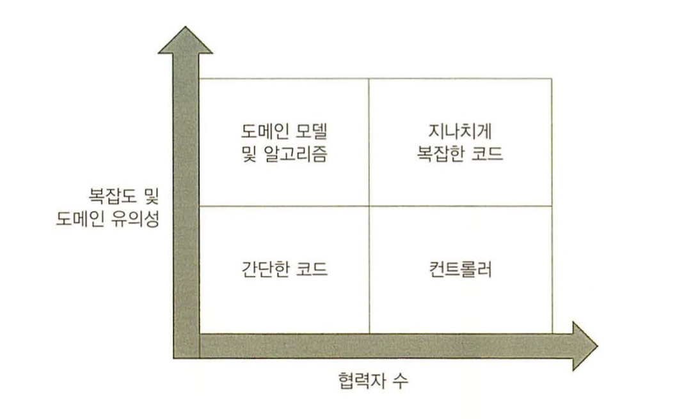
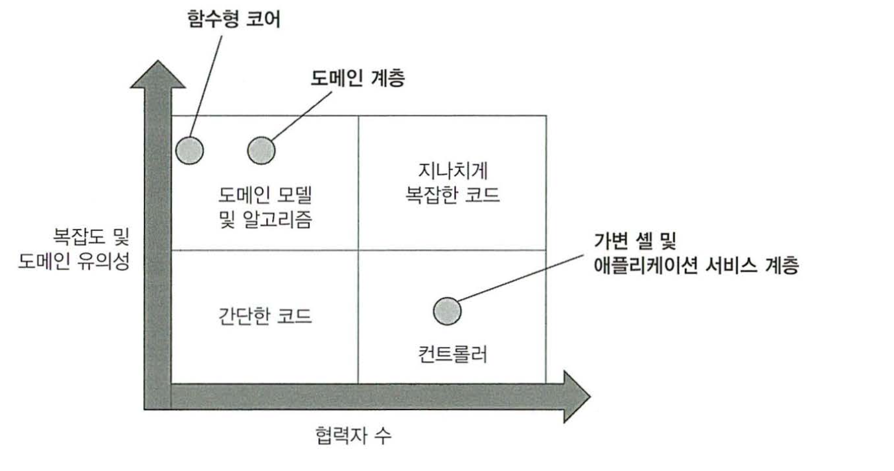
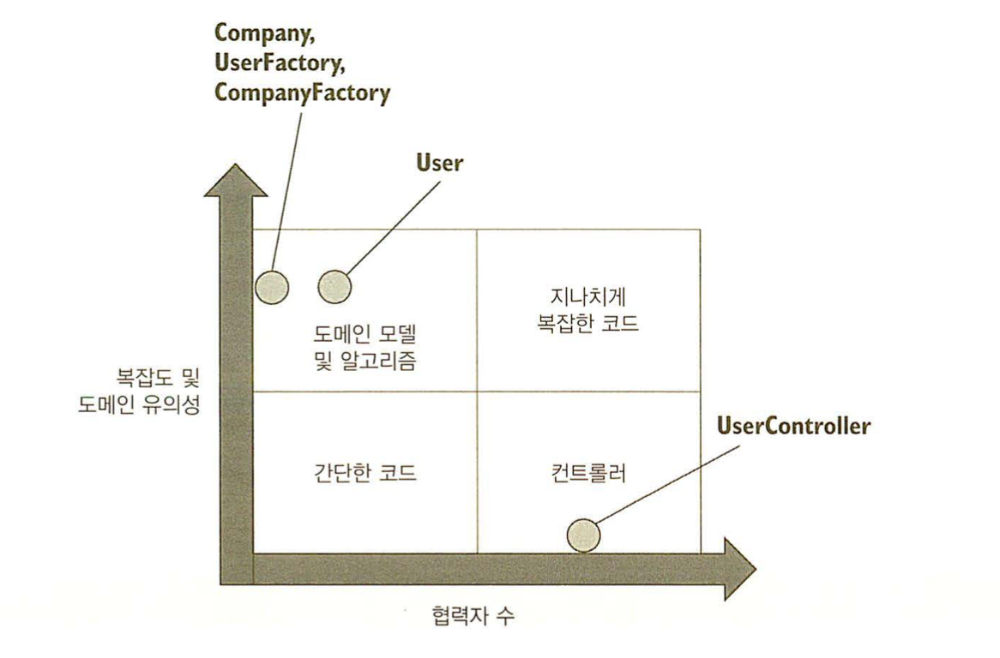
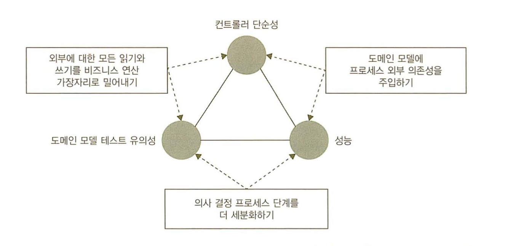

# 가치 있는 단위 테스트를 위한 리팩터링

## 다루는 내용
```
* 네 가지 코드 유형 알아보기
* 험블 객체 패턴 이해
* 가치 있는 테스트 작성
```

## 리팩터링할 코드 식별하기

### 코드의 네 가지 유형
* 모든 코드는 2차원으로 분류가 가능
  * 복잡도 또는 도메인 유의성
    * 도메인 유의성: 프로젝트의 문제 도메인과 얼마나 연관이 있는가
  * 협력자 수
    * 가변의존성, 외부의존성의 경우 테스트 비용이 많이 들어감
    * 협력자 자체가 외부 협력자일 경우, 비용이 많이 들어감
* 코드 복잡도, 도메인 유의성, 협력자 수의 조합으로 네가지 코드유형 분류가 가능
  * 
  * 도메인 모델과 알고리즘
    * 단위테스트 도입시 적은 비용으로 큰 가치를 얻을 수 있음
  * 간단한 코드
    * 기본 생성자, 한줄 속성 등
    * 테스트가 필요하지 않음
  * 컨트롤러
    * 외부 애플리케이션 같은 다른 구성요소의 작업을 조정
  * 지나치게 복잡한 코드
    * 예시로 덩치가 큰 컨트롤러 (애플의 ViewController?)
    * 가장 테스트가 어려움, 일단은 작게 분리하는게 1순위
      * 컨트롤러와 도메인 모델 및 알고리즘으로 나누어야 함
    * 컨트롤러가 로직을 포함하게 되면, 이쪽으로 빠지기가 쉬움

### 험블 객체 패턴을 사용해 지나치게 복잡한 코드 분할
#### 험블 객체 패턴
```
지나치게 복잡한 코드는, 여러 기능들이 섞여있는 경우가 많은데,
테스트의 측면으로 볼때 이걸 단순하게 `테스트 하기 쉬운 행위`, `테스트 하기 어려운 행위`로 나눌 수 있다.
이때 `테스트 하기 어려운 행위`를 험블객체라는 이름으로 분리 하는 것을 험블 객체 패턴이라고 한다.
즉, 로직과 인터페이스들은 단일 책임 원칙을 따라가도록 리팩토링.
```
* 보통 외부와 연결되는 것들은 테스트하기 어려운 경우가 많음.
* 따라서 중요한 로직과 그 외의 것들을 분리
* 그러면 함수형 아키텍처, 육각형 아키텍처와 비슷한 모양새를 띄게 됨
* 
* `지나치게 복잡한 코드`를 함수형, 육각형 아키텍처로 분리하면 위 그림처럼 될 수 있음
* 이런 아키텍처 디자인 패턴들이 몇가지가 있는데..
  * MVC
  * MVP
  * MVVM 등등..
* 결국 이 패턴들 또한 뷰, 모델, 비즈니스로직을 분리하는데 특화되어 있고,
* `지나치게 복잡한 코드`에 험블 객체 패턴을 도입하는 것으로 귀결된다.

## 가치 있는 단위 테스트를 위한 리팩터링

### 고객 관리 시스템
* 모든 사용자는 DB에 저장
* 이메일 변경 기능
* 이메일이 회사 도메인인 경우 직원, 아니면 고객
* 직원 수를 체크
* 변경 후 외부에 알림

```Swift
class User {
    private(set) var id: String
    private(set) var email: String
    private(set) var type: UserType

    public func changeEmail(userID id: Int, newEmail: String) {
        /// 이 코드처럼 도메인 클래스가 스스로 DB를 검색하고 저장하는 방식을 활성 레코드 패턴이라고 함.
        /// 코드 베이스가 커지면 커질수록, 확장에 애로사항이 생김.
        let data = Database.getUserById(id) // 외부 협력자
        self.id = id
        self.email = String(data[1])
        self.type = UserType(data: data[2])

        if self.email == newEmail { return }

        let companyData = Database.getCompany() // 외부 협력자
        let companyDomainName = String(companyData[0])
        let numberOfEmployees = Int(companyData[1])

        let emailDomain = newEmail.split("@")[1]
        let isEmailCorporate = emailDomain == companyDomainName
        let newType: UserType = isEmailCorporate ? .employee : .customer

        if self.type != newType {
            let delta = newType == .employee ? 1 : -1
            let newNumber = numberOfEmployees + delta
            Database.saveCompany(newNumber) // 외부 협력자
        }

        self.email = newEmail
        self.type = newType

        Database.saveUser(self) // 외부 협력자 
        MessageBus.sendEmailChangedMessage(self.id, newEmail) // 외부 협력자
    }

    public enum UserType {
        case customer
        case employee
    }
}
```

### 리팩터링 1. 암시적 의존성을 명시적으로 만들기
* DB와 메시지버스에 인터페이스를 두고, 의존성 주입을 시킴.
* 테스트에서는 Mock으로 처리.

### 리팩터링 2. 애플리케이션 서비스 계층 도입
* 험블 컨트롤러로 외부 시스템과의 통신을 옮김.

```Swift
class UserController { // 험블 컨트롤러
    private let database = DataBase() // 의존성 주입이 되지 않음
    private let messageBus = MessageBus() // 의존성 주입이 되지 않음

    public func changeEmail(userID: Int, newEmail: String) {
        // DB데이터를 모델링 하는건 서비스에 속하면 안됨.
        let data = self.database.getUserById(userID)
        let email = String(data[1])
        let type = UserType(data: data[2])
        var user = User(userID, email, type) 
        
        // 위와 마찬가지
        let companyData = self.database.getCompany()
        let companyDomainName = String(companyData[0])
        let numberOfEmployees = Int(companyData[1])

        let newNumberOfEmployees = user.changeEmail(newEmail, companyDomainName, numberOfEmployees)

        self.database.saveCompany(newNumberOfEmployees)
        self.database.saveUser(user)
        self.messageBus.sendEmailChangedMessage(userID, newEmail) // 이메일이 이전과 다른지 검사하지 않고, 무조건 메시지를 전송.
    }
}

extension User {
    // 위 험블 컨트롤러를 반영한 후 수정된 changeEmail.
    // 더이상 협력자를 필요로 하지 않지만, 여전히 많은 책임을 지고 있다.
    public func changeEmail(newEmail: String, companyDomainName: String, numberOfEmployees: Int) -> Int {
        if self.email == newEmail { return numberOfEmployees }

        var numberOfEmployees = numberOfEmployees

        let emailDomain = newEmail.split("@")[1]
        let isEmailCorporate = emailDomain == companyDomainName
        let newType: UserType = isEmailCorporate ? .employee : .customer

        if self.type != newType {
            let delta = newType == .employee? 1 : -1
            let newNumber = numberOfEmployees + delta
            numberOfEmployees = newNumber
        }

        self.email = newEmail
        self.type = newType

        return numberOfEmployees
    }
}
```

### 리팩터링 3. 애플리케이션 서비스 복잡도 낮추기
* 재구성 로직 추출(모델링)
  * 이때 ORM을 이용(Object Relational Mapping)
* DB를 모델로 모델링하는 클래스 작성
  
```Swift
public class UserFactory {
    public class func create(data: Data) -> User {
        // Precondition은 예외를 발생시키는 클래스인데,
        // Swift는 try catch를 사용하면 되지만, 메소드에 변형을 가해야 하므로
        // 간략히 쓰고자 그냥 씀..
        Precondition.Requires(data.length >= 3)

        let id = Int(data[0])
        let email = String(data[1])
        let type = UserType(data: data[2])

        return User(userID: id, email: email, userType: type)
    }
}
```

### 리팩터링 4. 새로운 Company 클래스

```Swift
class Company {
    private(set) var domainName: String
    private(set) var numberOfEmployees: Int

    public func changeNumberOfEmployees(delta: Int) {
        Precondition.Requires(self.numberOfEmployees + delta >= 0)

        // 직원 수는 회사에서 관리
        self.numberOfEmployees += delta
    }

    public func isEmailCorporate(email: String) -> Bool {
        let emailDomain = email.split("@")[1]
        
        // 회사 이메일 도메인 검증 또한 회사에서 관리
        return self.domainName == emailDomain
    }
}

class UserController {
    private(set) database = DataBase()
    private(set) messageBus = MessageBus()

    public func changeEmail(userID: Int, newEmail: String) {
        // DB를 모델링하는 과정, 리팩토링하며 만든 팩토리 클래스가 수행.
        let user = UserFactory.create(data: self.database.getUserById(userID))
        let company = CompanyFactory.create(data: self.database.getCompany())

        // 이메일을 바꾸는 과정. 아래 재작성한 User가 수행
        user.changeEmail(newEmail: newEmail, company: company)

        // 외부 협력자를 호출
        self.database.saveCompany(company)
        self.database.saveUser(user)
        self.messageBus.sendEmailChangedMessage(userID, newEmail)
    }
}

class User {
    private(set) var id: Int
    private(set) var email: String
    private(set) var type: UserType

    public func changeEmail(newEmail: String, company: Company) {
        if self.email == newEmail { return }
        
        // 이메일 검증 과정, 위에서 구현한 Company에서 처리 (책임 분산)
        let newType = company.isEmailCorporate(newEmail) ? .employee : .customer

        if self.type != newType {
            let delta = newType == .employee ? 1 : -1
            // 직원수 또한 Company에서 처리 (책임 분산)
            company.changeNumberOfEmployees(delta)
        }

        self.email = newEmail
        self.type = newType
    }
}
```

### 리팩토링 정리



* 역할과 책임들이 나뉘어져, `지나치게 복잡한 코드`가 컨트롤러와 도메인모델 및 알고리즘으로 분리됨.
* User같은 경우, 협력자가 생겨 테스트가 이전보다 어려워지긴 했으나.. 기존의 `지나치게 복잡한 코드`를 생각하면 전체적으로 이득을 본 셈. (이 설명을 근데 굳이 쓸 필요가 있었나?)
* 이제는 마지막에 저장하기 전까지는 데이터가 메모리에 남아있기 때문에, 출력 기반, 상태 기반 테스트가 용이해짐


## 최적의 단위 테스트 커버리지 분석

### 리팩터링 이후 분석

||협력자가 적음|협력자 많음|
|---|---|---|
|복잡도와 도메인 유의성이 높음|User.changeEmail <br/>Company.changeEmployees<br/>Company.isEmailCorporate<br/>CompanyFactory.create||
|복잡도와 도메인 유의성이 낮음|User.init<br/>Company.init|UserController.changeEmail|

### 도메인 계층과 유틸리티 코드 테스트

```Swift
void func test_고객에서_직원으로() {
    let company = Company("mycorp.com", 1)
    var sut = User(1, "user@gmail.com", .customer)

    sut.changeEmail("new@mycorp.com", company)

    XCTAssertEqual(2, company.numberOfEmployees)
    XCTAssertEqual("new@mycorp.com", sut.email)
    XCTAssertEqual(UserType.employee, sut.type)
}

void func test_직원에서_고객으로() {}
void func test_타입은_변하지않을때() {}
void func test_이메일이_바뀌지않을때() {}
```

### 세 사분면에 대한 코드 테스트
* User와 Company는 생성자뿐이기도 하고, 단순하기에 테스트할 필요가 없다.
  * 다만 코드가 복잡해지면 테스트를 해야한다.

### 전제조건은?
* 전제조건이 있는 상황이라면 테스트가 필요하나,
* 도메인 유의성이 없는 경우(외부 협력자쪽 통신을 검증하거나 하는 경우 등..)는 굳이 할 필요가 없다.

## 컨트롤러에서 조건부 로직 처리
* 조건부 로직을 처리하면서, 외부 협력자 없이 도메인 계층을 유지보수 하는건 어느정도 절충이 있어야 한다.
* 이상적인 상황은 아래와 같은 세 단계이다.
  * 저장소에서 데이터 검색
  * 비즈니스 로직 실행
  * 데이터를 다시 저장
* 하지만 현실적으로 이런 구조가 되기엔 쉽지 않아, 어느정도 절충하는 방법이 있다.
  * 외부에 대한 모든 읽기와 쓰기를 가장자리로 밀어낸다(되도록 시작이나 끝으로)
  * 도메인 모델에 외부 의존성을 주입하고, 비즈니스 로직은 해당 의존성을 호출할 시점을 직접 결정할 수 있게 한다.
  * 의사 결정 프로세스 단계를 더 잘게 세분화 시킨다.
* 결국 균형을 맞추는건데, 균형을 맞추는건 세가지로 나뉜다.
  * 도메인 모델 테스트 유의성
  * 컨트롤러 단순성
  * 성능
* 절충하는 방법과 균형하는 방법을 비교해보면..
  * 외부에 대한 읽기와 쓰기를 밀어내기
    * 컨트롤러를 단순화시키고 외부 의존성과 도메인 모델을 분리하지만, 성능이 저하된다.
  * 도메인 모델에 프로세스 외부 의존성을 주입하기
    * 성능을 유지하면서 컨트롤러를 단순하게 하지만, 도메인 모델의 테스트 유의성이 떨어진다.
  * 의사 결정 프로세스 단계를 세분화 하기
    * 성능과 도메인 모델 테스트 유의성은 좋지만, 컨트롤러가 복잡해진다.
* 결국 세가지중 두가지 방법을 택해야 한다..
* 
* 성능과 유지보수가 소프트웨어에서 상당히 중요하기 때문에, 결국 세번째 옵션이 채택 되는데, 그러면 `지나치게 복잡한 코드` 사분면에 들어갈 가능성이 크다.

### CanExecute / Execute 패턴 사용
* 실행이 가능한지 검사한 후, 실행을 하도록 하는 패턴.
* 이를 사용해서 비즈니스 로직이 도메인 모델에서 컨트롤러로 유출되는 것을 방지한다.
* `CanExecute`를 컨트롤러에 넣을수도 있다.
* 하지만 도메인 모델의 캡슐화가 안좋아지고,
* 파편화의 우려가 있다.
* 따라서 도메인모델에 새로운 메서드를 둬서, 도메인의 `Execute`의 전제조건으로 삼는다.

### 도메인 이벤트를 사용해 도메인 모델의 변경사항 추적
* 도메인 모델의 중요한 변경 사항을 추적하고, 
* 변경하면 외부 의존성에 대한 호출로 변환한다.
* 따라서 컨트롤러에서 추적에 대한 책임이 없어진다.
* MVVM에서 주로 사용되는 옵저버 패턴도 고려해볼 수 있다.

## 결론
* 결국 사이드이펙트를 추상화 하고, 그것을 테스트할수 있는 환경을 갖추는게 중요하다.
* 추상화 대상을 테스트 하기보다는, 추상화를 테스트하는것을 목표로 한다.
* 4 사분면으로 나누었을 때 `지나치게 복잡한 코드`에 있는것을 세분화시키는게 중요하다.
* 도메인 이벤트 or CanExecute/Execute 패턴을 사용해도 좋지만, 파편화가 불가피한 상황이 생길수도 있다.
* 외부의존성을 참조하지 않는다면, 결국 협력자를 늘려서라도 코드를 세분화 시킬수 있다.
* 세부 구현사항을 줄여 -> 식별할수 있는 동작이 되고, 또 다른 테스트로 다루게 된다.