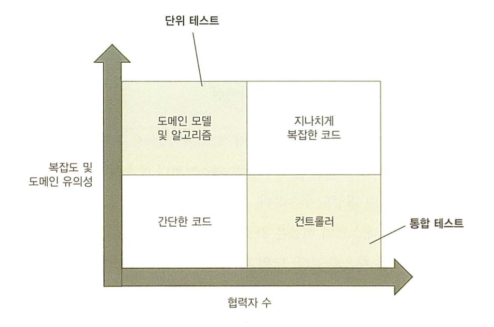
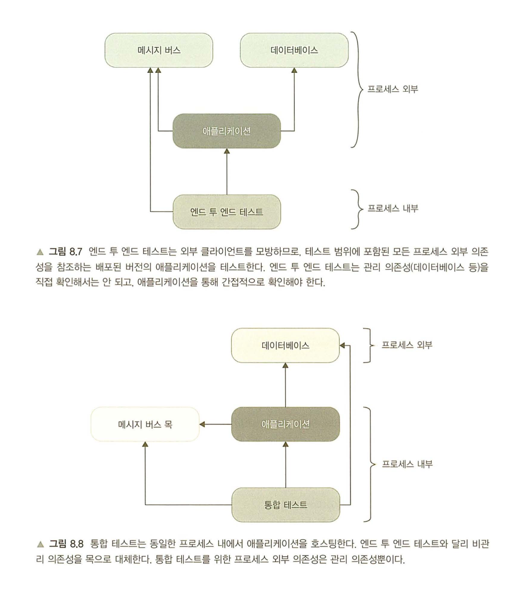
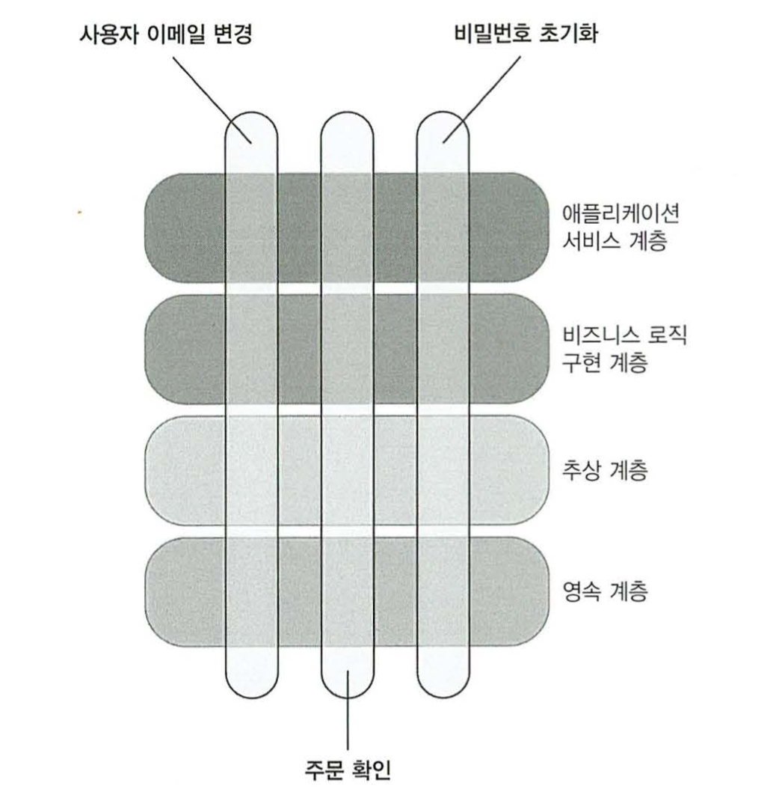
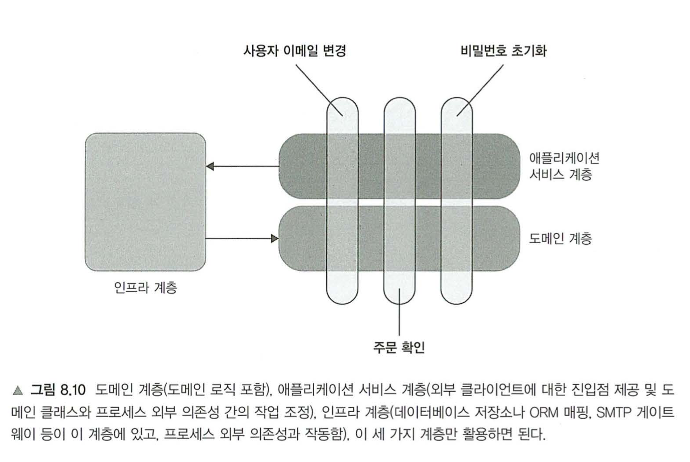

# 통합테스트를 하는 이유

## 다루는 내용
```
* 통합테스트의 역할 이해
* 테스트 피라미드의 개념 자세히 살펴보기
* 가치 있는 통합 테스트 작성
```

## 통합테스트는 무엇인가?
### 통합테스트의 역할
* 단위 테스트가 아닌 테스트
  * 단일 동작 단위를 검증하지 않고
  * 상대적으로 느리게 수행하고
  * 다른 테스트를 한번에 처리한다
* 시스템이 외부 의존성과 통합해 어떻게 작동하는지를 검증한다
* 코드 사분면에서는 컨트롤러 사분면에 속하는 코드를 다룬다
* 
* 지나치게 복잡한 코드는 테스트가 아닌 리팩토링 대상이며, 간단한 코드는 테스트를 할 필요가 없다.

### 다시 보는 테스트 피라미드
* 단위테스트와 통합테스트는 균형을 유지해야하는데, 그 이유는 각각의 역할이 다르기 때문이다.
* 통합테스트의 경우 회귀방지와 리팩터링 내성이 상대적으로 우수한 편이고
* 단위테스트의 경우 속도(빠른 피드백)와 유지보수성이 상대적으로 우수한 편이다
* 우선적으로는 단위테스트를 코드에 가능한 많이 도입하고,
* 통합테스트는 주요 흐름과 단위테스트에서 다루기 힘든 상황들을 다루는것이 좋다.

### 통합테스트와 빠른 실패
* 외부 의존성과의 상호작용을 모두 확인하려면...
  * 가장 긴 주요 흐름을 선택한다 (최대한 많은 상호작용을 거쳐가는 흐름)
  * 그 흐름에서 거치지 않는 상호작용은 추가로 통합테스트를 작성한다
* 단위테스트와는 다르게, 통합테스트는 빠른 실패 원칙을 적용한다.

#### 빠른 실패 원칙
```
예기치 않은 오류가 발생하자마자 연산을 중단하는 것.
* 피드백 루프 단축: 버그를 빨리 발견할수록 더 쉽게 해결이 가능하다.
* 지속성 상태 보호: 버그는 앺플리케이션 상태를 손상시키는데, 빨리 실패할수록 손상의 확산을 막을 수 있다.

예외는 프로그램 흐름을 중단하고, 실행 스택에서 가장 높은 레벨로 올라간 후 작동을 중단하는데,
이것은 빠른 실패 원칙에 부합한다.
```

## 어떤 프로세스의 외부 의존성을 직접 테스트해야하는가?
### 프로세스 외부 의존성의 두가지 유형
* 관리 의존성 (전체를 제어할 수 있는 프로세스 외부 의존성)
  * 대표적으로 데이터베이스
  * 애플리케이션을 통해서만 접근할 수 있다
  * 상호작용은 외부 환경에서 볼 수 없다
  * 직접 접근하지 않고, 애플리케이션에서 제공하는 API를 통해 접근한다
* 비관리 의존성(전체를 제어할 수 없는 프로세스 외부 의존성)
  * 대표적으로 SMTP서버, 메시지 버스 등
  * 상호작용을 외부에서 볼 수 있다
  * 다른 애플리케이션에서 볼 수 있는 사이드이펙트를 발생시킨다.
* 관리 의존성과의 통신 -> 구현 세부사항
* 비관리 의존성과의 통신 -> 식별할 수 있는 동작
* 관리 의존성은 실제 인스턴스를 사용하고, 비관리 의존성은 Mock을 활용한다.

### 관리 의존성이면서 비관리 의존성인 프로세스의 외부 의존성 다루기
* 대표적으로 다른 애플리케이션에 접근이 가능한 데이터베이스가 있다.
* 다른 애플리케이션에 접근이 가능한 테이블을 비관리 의존성으로 취급한다.
  * 해당 테이블은 메시지 버스 역할을 한다.
  * 통신 패턴이 바뀌지 않도록 하려면 Mock을 사용한다
* 데이터베이스와의 상호작용을 검증하지 말고, 데이터베이스의 최종 상태를 확인한다.
* 데이터베이스 안에서 관리 의존성과 비관리 의존성을 잘 구분하는것이 중요하다.
  * 비관리 의존성의 역할을 하는 테이블의 경우.. 다른 애플리케이션이 어떻게 반응하는지 확인할 수 없기 때문에 되도록이면 상호작용을 하는 방식을 변경하지 않도록 한다.

### 실제 데이터베이스를 사용할수 없으면?
* 통합테스트에서 실제 버전으로 사용할수 없는 경우가 많은데,
* Mockable하게 처리하자니 리팩터링 내성이 저하되고, 회귀방지도 떨어진다.
* 따라서 데이터베이스를 포함하여 테스트가 불가능하다면 통합테스트 보다는, 도메인 모델의 단위테스트에만 집중하는게 좋다.

## 예제
* 저번에 리딩을 하면서 보니, 코드가 의미가 없어보여 생략했습니다 ㅡ,ㅡ

### 데이터베이스와 메시지 버스 분류하기
* 데이터베이스는 관리 의존성
  * 모델을 삽입하고
  * 로직을 실행하여 검증
* 메시지 버스는 비관리 의존성
  * Mock으로 대체하여 컨트롤러와 Mock간의 상호작용을 검증한다.

### 엔드투엔드 테스트?
통합 테스트 범주에 관리 의존성을 포함시키고, 비 관리 의존성만 목으로 대체하면
통합테스트의 보호 수준이 엔드투엔드 테스트와 비슷해지므로 생략할 수 있다.



## 의존성 추상화를 위한 인터페이스 사용
### 느슨한 결합
```Swift
public protocol MessageBusProtocol {}
public class MessageBus: MessageBusProtocol {}

public protocol UserRepositoryProtocol {}
public class UserRepository: UserRepositoryProtocol {}
```

* 단일 구현을 위한 인터페이스는 추상화가 아니며
* 결합도도 낮다고 볼 수 없다.
* 추상화는 발견인데, 의미상 추상화가 존재하지만, 코드에서 명확하게 정의되지 않았을 때 발견되는 것이다.
* 인터페이스가 추상화되려면 구현이 두가지 이상은 있어야 한다.
* 기본적 원칙인 YAGNI(You Aren't Gonna Need It, 필요한것만 만들어서 써라)에도 위배된다.
* 결론적으로 필요없는 추상화는 이러한 단점이 생긴다.
  * 기회비용 낭비
  * 코드베이스 크기 증가

 ### 외부 의존성에 인터페이스를 사용하는 이유?
 * Mock을 사용하기 위함
 * 따라서 의존성을 Mock으로 처리할 필요가 없다면.. 인터페이스를 따로 두지 않는다.
 * 위에서 설명한대로라면 비관리 의존성에 대해서만 인터페이스를 사용하는걸 권장한다.
 
### 프로세스 내부 의존성을 위한 인터페이스 사용
* 내부 시스템 객체들중 구현이 하나만 있을 때 인터페이스를 구현하는것은 좋지 않다.
* Mock을 처리하기 위한다 하더라도, 도메인 클래스간에 상호작용을 확인할 필요는 없다.
  * 깨지기 쉬운 테스트가 되고,
  * 결국 리팩터링 내성이 떨어지기 때문이다. (거짓 양성 생성)

## 통합 테스트 모범 사례
통합 테스트를 활용하기 위한 몇가지 지침이 있다.
```
* 도메인 모델 경계 명시
* 애플리케이션 내 계층 줄이기
* 순환 의존성 제거
```

### 도메인 모델 경계 명시하기
* 코드베이스에서 도메인 모델을 명시적이고 잘 알려진 위치에 둔다.
* 이렇게 하면 코드의 해당 부분을 더 잘 보여주고 더 잘 설명할 수 있다.
* 도메인 클래스와 컨트롤러 사이에 경계를 명확히 하기 때문에 테스트에도 도움이 된다.

### 계층 수 줄이기


* 추상화 계층이 너무 많으면, 코드베이스 탐색이 어려워진다.
* 간접 계층은 모든 기능이 각각의 개층으로 전개되고, 모이는데 상당한 노력이 필요하다. 따라서 코드 추론이 어려워진다.
* 또 추상화가 많을수록 컨트롤러와 도메인모델 사이의 명확한 경계가 없어지기도 한다.
* 각 계층을 따로 검증하는 경향이 강하기도 하다.
* 특정 계층의 코드만 실행하고, 하위 계층은 Mock으로 처리하기 때문에, 리팩터링 내성이 떨어진다.
* 따라서 간접 계층은 가능한 적게 사용하는것이 좋다.
* 세가지정도로만 활용하면 된다.
  * 도메인 모델
  * 애플리케이션 서비스 계층(컨트롤러)
  * 인프라 계층



### 순환 의존성 제거하기
* 추상계층과 마찬가지로, 코드를 읽고 이해하기가 쉽지 않다.
* 동작의 분리가 어려워 Mock으로 처리할 경우가 생긴다.
* 그걸 위해 인터페이스를 사용한다면 문제가 가려질 뿐, 확인해야할 내용이 늘어나기만 한다.
* 콜백사용보다는, 결과를 반환하게하는쪽으로 리팩토링을 진행한다.
* 모두 제거하는 방향으로 리팩토링을 하기는 어렵지만, 그래도 가능한 노력한다.

### 다중 실행 구절 사용
```
* 준비 : 시용자등록에 필요한 데이티 준비
* 실행 : UserController.RegisterUser() 호출
* 검증 : 등록이 성공적으로완료됐는지 획인히기 위해 데이터베이스조회 
* 실행 : UserController.DeleteUser()호출
* 검증 : 시용지카식치1됐는지 확인히-기 위해 데이터베이스 조회
```

* 흐름은 자연스럽지만, 테스트가 초점을 잃고 너무 커질 수 있다.
* 따라서 실행을 고유의 테스트로 추출해 나누는것이 좋다.
* 외부 의존성을 거치는 테스트의 경우 원하는 상태를 만들기가 어려워 나누기가 어려워서,
* 차라리 상호작용을 줄이는게 좋다.

## 로깅 테스트
로깅은 회색지대로, 테스트 여부에 대해 복잡한 생각이 든다.

```
* 로깅을 조금이라도 테스트 해야 하는가?
* 만약 그렇다면 어떻게 테스트 해야 하는가?
* 로깅이 얼마나 많으면 충분한가?
* 로거 인스턴스를 어떻게 전달해야 하는가?
```

### 로깅을 테스트 해야 하는가?
* 개발자 이외의 다른 사람이 보는 경우라면, 식별할수 있는 동작이 되므로 테스트가 필요하다.
* 하지만 보는이가 개발자 뿐이라면 구현 세부사항이므로 테스트할 필요가 없다.
* 로깅 라이브러리를 작성하는 경우, 그 라이브러리의 식별할수있는 가장 중요한 동작이므로 테스트가 필요하다.
* 로깅은 다음과같이 두가지 유형으로 나뉜다.
  * 지원 로깅 (식별할수 있는 동작)
    * 담당자나 관리자가 추적할 수 있는 메시지
  * 진단 로깅 (구현 세부사항)
    * 개발자가 애플리케이션 내부 상황파악을 위한 메시지

### 로깅을 어떻게 테스트해야 하는가?
* 로깅은 프로세스 외부 의존성이 있기 때문에, 외부 의존성에 영향을 주는 다른 기능과 동일한 규칙이 적용된다.
* 애플리케이션과 로그 저장소간의 상호 작용을 검증하려면 Mock을 써야 한다.
* 하지만 지원로그와 진단 로그를 나누어서, 지원로그만 Mock을 사용하도록 한다.

### 로깅이 얼마나 많으면 충분한가?
* 지원 로깅은 요구사항이라 요구사항 대로 작성하면된다.
* 진단로깅의 경우 과도하게 사용하지 않는것이 중요하다.
  * 과도한 로깅은 코드를 혼란스럽게 한다.
  * 로그 신호 대비 잡음 비율이 중요한데, 로그가 많을수록 정보를 찾기 어려워진다.
    * 따라서 신호를 최대한 늘리고, 잡음을 최소한 줄이는게 중요하다.
  * 도메인 모델에서는 진단로깅을 사용하지 않도록 한다.
    * 필요하다면 디버깅을 할때만 사용후 제거한다.

### 어떻게 심어야 할까?
* 정적 메서드로 전달한다
  * 이는 앰비언트 컨텍스트라고 불리는 안티패턴이며, 두가지 단점이 있다
    * 의존성이 숨어있고 변경이 어렵다
    * 테스트가 어려워진다.
* 메서드 혹은 생성자에 명시적으로 전달한다
  * 이게 불편해서 위에 작성한 앰비언트 컨텍스트에 의존해야 한다면.. 문제의 징후가 될 수 있다.

## 결론
* 식별할 수 있는 동작인지, 구현 세부사항인지에 대한 관점으로 외부 의존성과의 통신을 살펴봐야 한다.
