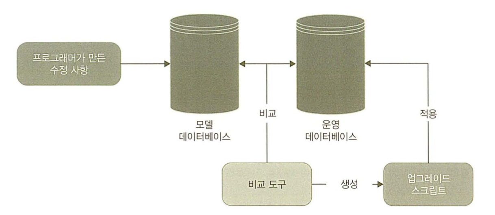
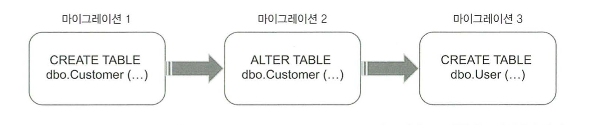
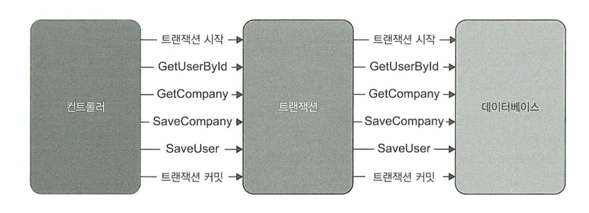
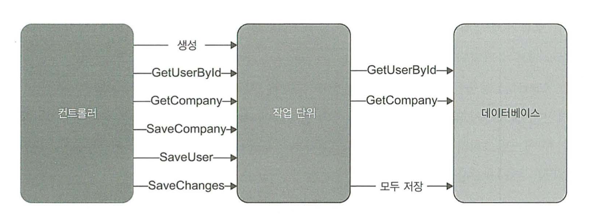

# 데이터베이스 테스트

## 다루는 내용
```
* 데이터베이스 테스트를 위한 전제 조건
* 데이터베이스 테스트 모범 사례
* 테스트 데이터 생명 주기
* 테스트 내 데이터베이스 트랜잭션 관리
```

## 데이터베이스 테스트를 위한 전제조건
* 형상 관리 시스템에 데이터베이스 유지
* 모든 개발자를 위한 별도의 데이터베이스 인스턴스 사용
* 데이터베이스 배포에 마이그레이션 기반 방식 적용

### 데이터베이스를 형상 관리 시스템에 유지
* 데이터베이스 스키마를 일반 코드로 취급한다.
* 스키마를 형상 관리 시스템에 저장한다.
  * 참조 데이터(수정이 불가능한 데이터)도 스키마로 취급한다.

이렇게 유지를 함으로써 얻는 장점은
* 히스토리 확인 가능
* 원천정보의 통일

### 모든 개발자를 위한 별도의 데이터베이스 인스턴스
* 다른 개발자들과 데이터베이스를 공유하게되면 몇가지 애로사항이 생기는데..
  * 다른 개발자가 실행한 테스트는 서로 간섭이 된다.
  * 하위 호환성이 없는 변경으로 다른 개발자의 작업을 막을 수 있다.
* 따라서 가능하다면 개발하는 환경의 장비에서 데이터베이스 인스턴스를 사용하는게 좋다.

### 상태 기반 데이터베이스 배포와 마이그레이션 기반 데이터베이스 배포

#### 상태 기반 방식



* 배포중 비교 도구가 스크립트를 생성해서 운영 데이터베이스를 모델 데이터베이스와 비교해 최신 상태로 유지한다.
* 다만 물리적 모델 데이터베이스는 원천 데이터가 아니게 된다.
* SQL 스크립트로 관리된다.

#### 마이그레이션 기반 방식



* 어떤 버전에서 다른 버전으로 전환하는 명시적 마이그레이션을 의미한다.
* 자동으로 동기화 하기 위한 도구를 쓸 수 없고, 업그레이드 스크립트를 직접 작성한다.
* 문서화되지 않은 변경 사항을 발견하기 용이하다

#### 상태 기반 방식보다 마이그레이션 기반 방식을 선호하라

||데이터베이스 상태|마이그레이션 매커니즘|
|---|---|---|
|상태 기반 방식|✅ 명시적|❌ 암묵적|
|마이그레이션 기반 방식|❌ 암묵적|✅ 명시적|

* 상태 기반 방식은 상태를 형상 관리에 저장함으로써 상태를 명시하고 비교 도구가 마이그레이션을 암묵적으로 제어할 수 있게 한다.
* 마이그레이션 기반 방식은 마이그레이션을 명시적으로 하지만 상태를 암묵적으로 둔다.
* 데이터 베이스 상태가 명확하면 병합 충돌을 처리하기가 수월하다
* 마이그레이션 매커니즘이 명확하면 데이터 모션 문제를 해결하는데 도움이 된다.

```
데이터 모션?
새로운 데이터베이스 스키마를 준수하도록 기존 데이터의 형태를 변경하는 과정
```

* 대부분의 프로젝트는 데이터 모션이 병합 충돌보다 훨씬 더 중요하다.
  * 예를 들어 Name을 FirstName과 LastName으로 나눌때는 기존 컬럼을 삭제하고 둘로 만들어야하며, 스크립트 또한 작성해야하는데
  * 상태 주도 방식을 사용하여 변경을 구현하기가 쉽지 않다.
  * 결과적으로 대다수의 프로젝트에서 상태 기반 방식은 실용적이지 않다.

## 데이터베이스 트랜잭션 관리

제품 코드에서 트랜잭션을 처리하는 방법, 그리고 통합 테스트에서 트랜잭션을 사용하는 방법을 알아본다.

### 제품 코드에서 데이터베이스 트랜잭션 관리하기
* 비즈니스 연산에서 데이터 변경이 포함된다면, 모순을 피하기 위해 데이터베이스의 데이터는 원자적으로 업데이트가 이루어져야 한다.
  * 원자적 업데이트 -> 모두 수행하거나 전혀 수행하지 않는 것
* 잠재적 모순을 피하려면 결정 유형을 두가지로 나누어야 한다.
  * 업데이트 할 데이터
  * 업데이트 유지 또는 롤백 여부

#### 데이터베이스 트랜잭션에서 데이터베이스 연결 분리하기



* 컨트롤러는 업데이트를 수행할수 있는지에 대한 여부만 안다
* 업데이트를 시도 해야만 이런 단계를 밟을 수 있다.
* 따라서 두가지로 분류하여 책임을 나눈다.
  * 리포지토리
    * 데이터에 대한 접근과 수정을 가능하게 하는 클래스
  * 트랜잭션
    * 업데이트를 완전히 커밋하거나 롤백하는 클래스

#### 작업 단위로 트랜잭션 업그레이드하기



* 트랜잭션을 작업 단위(unit of work)로 업그레이드 할 수있다.
* 비즈니스 로직 종료 시점에 모든 업데이트를 실행하므로
  * 트랜잭션 기간을 단축하고 혼잡성을 줄인다.
  * 호출 수도 줄이는 경우가 있다.
* 대부분의 ORM 라이브러리가 작업 단위 패턴을 구현한다.

### 통합 테스트에서 데이터베이스 트랜잭션 관리하기
* 테스트 구절 간에 데이터베이스 트랜잭션이나 작업 단위를 재사용하지 않는다.
* 따라서 통합 테스트에서는 최소한 3개의 트랜잭션 or 작업 단위를 사용한다 (준비, 실행, 검증등)

## 테스트 데이터 생명주기
공유 데이터베이스를 사용하면, 통합테스트를 서로 분리할 수 없는 문제가 생긴다.
두가지 방법으로 이 문제를 해결할 수 있다.

* 통합 테스트를 순차적으로 실행
* 테스트 실행 간에 남은 데이터 삭제

### 병렬 테스트 실행과 순차적 테스트 실행
* 모든 테스터가 고유한지 확인한다
* 성능 향상을 위해 순차적으로 통합 테스트를 실행한다
* 대부분의 단위 테스트 프레임워크는 별도의 테스트 모음을 정의하고, 병렬 처리를 비활성화 할 수 있다.
* 도커같은 툴을 이용해서 컨테이너로 병렬처리를 할 수도 있다.
  * 다만 비용이 너무 커지게되는 문제가 있다.

### 테스트 실행 간 데이터 정리
정리에는 몇가지 접근 방법이 있다.

* 각 테스트 전에 데이터베이스 백업 복원하기
  * 테스트 스위트 실행 시간이 빠르게 늘어난다.
* 테스트 종료 시점에 데이터 정리하기
  * 빠르긴 한데, 정리 단계를 건너뛰기 쉽다.
  * 테스트 도중 중단되면 정리가 안되는 경우도 생긴다.
* 데이터베이스 트랜잭션에 각 테스트를 래핑하고 커밋하지 않기
  * 결국 트랜잭션이 비워져있지 않으므로, 운영 환경과 다른 설정이 생성될 수 있다.
* 테스트 시작 시점에 데이터 정리하기
  * 빠르게 작동하고, 일관성이 있으며, 정리 단계 실수로 건너뛰지 않는다.

제약조건을 준수하기 위해 순서대로 데이터를 제거해야 한다.
스크립트를 기초 클래스에 작성하여, 자동화시키도록 노력한다.

### 인메모리 데이터베이스 피하기
SQLite와 같은 인메모리 데이터베이스로 교체할 수도 있다.
장점은..
* 테스트 데이터를 제거할 필요가 없음
* 작업 속도 향상
* 테스트 마다 인스턴스화 가능
문제점은..
* 일관성이 없다.
* 일관성이 없어서 거짓양성, 거짓음성이 발생하기 쉽다.

## 테스트 구절에서 코드 재사용하기
통합테스트는 유지보수 지표를 위해, 가능한 짧고 가독성이 좋게 만드는게 중요하다.
가장 좋은 방법은 비즈니스와 관련이 없는 기술적인 부분을 재사용이 가능하도록 비공개 처리, 혹은 헬퍼 클래스로 추출한다.
* 준비 구절에서 코드 재사용
  * 비공개 팩토리 메서드를 도입한다.
  * 처음 시작은 단순하게, 팩토리 메서드를 동일한 클래스의 위치에 배치하는걸 추천한다.
  * 문제가 생길 경우에만 별도의 헬퍼 클래스로 이동한다.
* 실행 구절에서 코드 재사용
  * 델리게이트 패턴을 도입을 고려한다.
* 검증 구절에서 코드 재사용
  * 헬퍼 메서드를 둔다.
  * 스파이 목과 같은 플루언트 인터페이스를 만들 수도 있다.

## 데이터베이스 테스트에 대한 일반적인 질문
* 쓰기 테스트는 철저하게 해야하지만, 읽기 테스트는 가능한 비용을 투자하지 않는다.
* 리포지토리 테스트가 필요한가?
  * 리포지토리는 `컨트롤러` 사분면에 포함된다.
  * 복잡도가 거의 없고 츠로세스 외부 의존성인 데이터베이스와 통신하므로 유지비가 증가한다.
  * 따라서 일반 통합테스트와 부담은 비슷하지만, 상대적으로 유익하지는 않다.
  * 결국 알고리즘, 도메인모델등 컨트롤러 역할 외의 기능들을 최대한 바깥으로 뺀다..